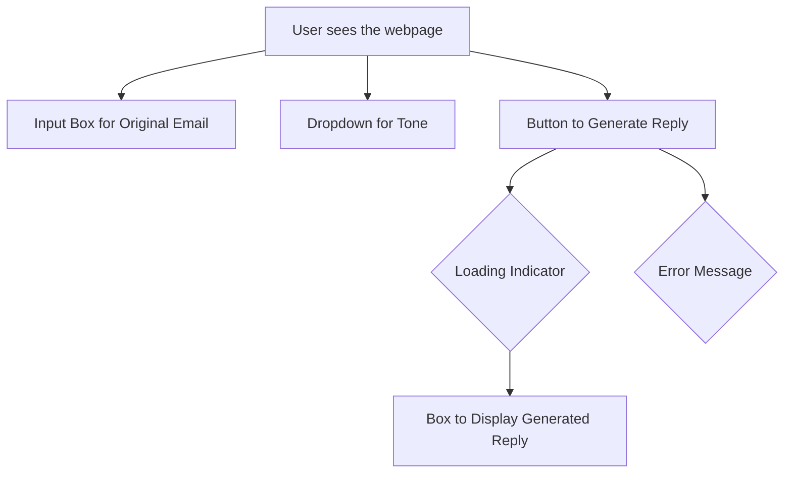
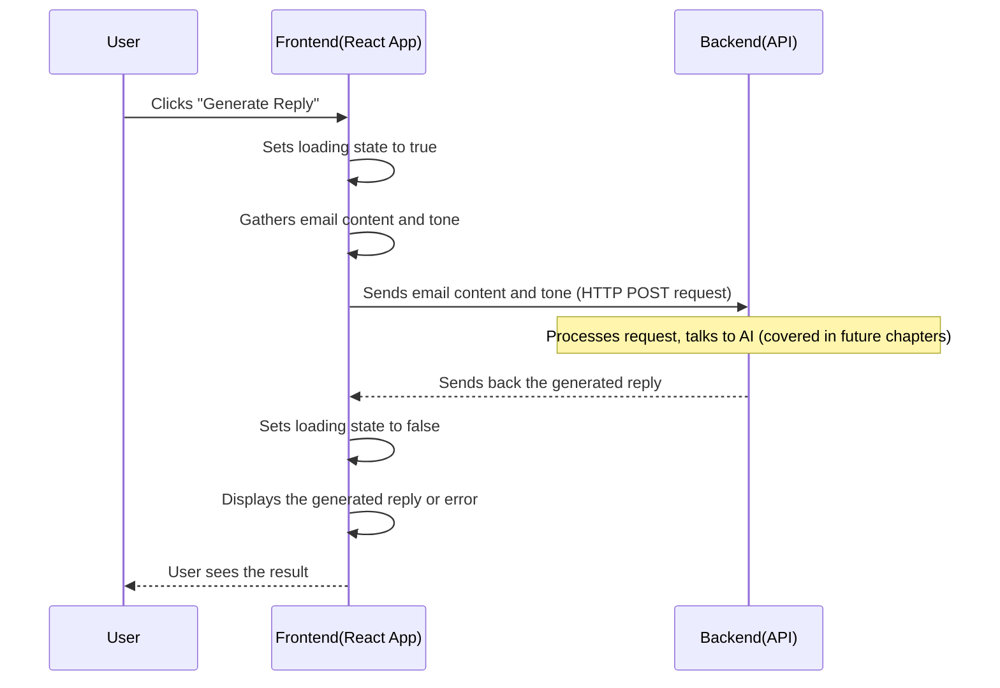

# Chapter 1: Frontend Web Application (React)

Welcome to the first chapter of the Ai Email Assistant tutorial! In this chapter, we'll dive into the part of the project you interact with directly: the **Frontend Web Application**.

## What Problem Does the Frontend Solve?

Imagine you've just received an email and need to write a reply. Sometimes, crafting the perfect response can be tricky, especially if you want a specific tone (like professional or friendly). Wouldn't it be great if an AI could help draft that reply based on the original email?

That's exactly what the **Frontend Web Application** helps you do! It's like the **dashboard** or the **control panel** for our AI Email Assistant. It provides a simple way for you to:

1.  **Input** the original email content you received.
2.  **Choose** the kind of reply you want (e.g., the tone).
3.  **Tell** the AI to generate a reply.
4.  **See** the AI's generated response.

Think of it as the friendly face of the project, making the powerful AI magic accessible with just a few clicks and some typing.

## What is the Frontend Built With?

Our frontend is built using popular web technologies:

*   **React:** A JavaScript library for building user interfaces. React helps us break down the interface into smaller, manageable pieces called **components**. Think of these components like **LEGO bricks** – you build complex structures (your web page) by combining simpler blocks (buttons, input fields, text areas).
*   **Vite:** A tool that helps start your development server and build your project very quickly. It's like a **speedy construction worker** that puts your LEGO bricks together fast so you can see your creation right away.
*   **Material UI (MUI):** A library of pre-designed React components that follow Google's Material Design guidelines. This helps make the application look nice and professional without having to build every button and input field from scratch. It's like having **pre-made, polished LEGO bricks** for common UI elements.
*   **Axios:** A tool for making requests to the backend (the part of the application that does the heavy lifting, like talking to the AI). We'll use this to send the email content and tone to the AI generator. Think of Axios as the **messenger** that carries requests and responses between your frontend dashboard and the backend engine.

## How Do We Use the Frontend?

Let's look at the core file for our frontend: `AiEmail-Frontend/src/App.jsx`. This file contains the main React component that renders our user interface.

Here's a simplified view of what the user sees:



The user flow is straightforward:

1.  **Paste Email:** Copy the content of the email you received and paste it into the large input box.
2.  **Select Tone:** Click the dropdown and choose a desired tone (like "Professional" or "Friendly").
3.  **Click Generate:** Click the button labeled "Generate Reply".
4.  **See Result:** The application will show a loading indicator, then display the AI-generated reply in a box below the button.

Let's see some bits of the `App.jsx` code that create this interface.

Here's how the input box for the original email is created using Material UI's `TextField` component:

```jsx
// Inside the App function component
<TextField
  fullWidth
  multiline
  rows={6}
  variant="outlined"
  label="Original Email Content"
  value={emailContent || ''} // Displays the current value
  onChange={(e) => setEmailContent(e.target.value)} // Updates value when user types
  className="textField"
  sx={{ mb: 2 }}
/>
```
This code uses the `TextField` component from Material UI to create a multi-line input area. `value` shows what's currently typed, and `onChange` is a function that updates the `emailContent` variable whenever the user types something.

Next, the dropdown for selecting the tone uses `FormControl`, `InputLabel`, `Select`, and `MenuItem` from Material UI:

```jsx
// Inside the App function component
<FormControl fullWidth sx={{ mb: 2 }} className="selectField">
  <InputLabel>Tone (Optional)</InputLabel>
  <Select
    value={tone || ''} // Displays the current tone
    label="Tone (Optional)"
    onChange={(e) => setTone(e.target.value)} // Updates tone when user selects
  >
    <MenuItem value="">None</MenuItem>
    <MenuItem value="professional">Professional</MenuItem>
    <MenuItem value="casual">Casual</MenuItem>
    <MenuItem value="friendly">Friendly</MenuItem>
  </Select>
</FormControl>
```
Similar to the `TextField`, this code creates a dropdown. `value` shows the selected tone, and `onChange` updates the `tone` variable when a different option is chosen.

Finally, the "Generate Reply" button is created using Material UI's `Button` component:

```jsx
// Inside the App function component
<Button
  variant="contained"
  onClick={handleSubmit} // Calls handleSubmit function when clicked
  disabled={!emailContent || loading} // Button is disabled if no content or if loading
  className="button"
  fullWidth
>
  {loading ? <CircularProgress size={24} /> : "Generate Reply"} {/* Show loading spinner or text */}
</Button>
```
This `Button` component is clickable. The `onClick` property is set to a function called `handleSubmit`. The button is `disabled` if the `emailContent` is empty or if the application is currently `loading` (waiting for the backend). It also cleverly shows a spinning circle (`CircularProgress`) when `loading` is true.

## How Does it Work Inside?

When you click the "Generate Reply" button, here's a simplified sequence of events:



The core logic for this interaction lives within the `handleSubmit` function in `AiEmail-Frontend/src/App.jsx`.

Let's look at the key parts of the `handleSubmit` function:

```jsx
// Inside the App function component
const handleSubmit = async () => {
  setLoading(true); // Start loading state
  setError(''); // Clear any previous errors

  try {
    // Use axios to send a POST request to the backend API
    const response = await axios.post(`https://aiemail-backend.onrender.com/api/email/generate`, {
      emailContent, // Send the content from the input box
      tone // Send the selected tone
    });

    // Update the state with the generated reply received from the backend
    setGeneratedReply(typeof response.data === 'string' ? response.data : JSON.stringify(response.data));

  } catch (error) {
    // If something goes wrong, set an error message
    setError('Failed to generate email reply. Please try again');
    console.error(error);
  } finally {
    // Always set loading state back to false when done (success or error)
    setLoading(false);
  }
};
```
This function is marked `async` because it performs an operation that takes time: sending a request to the backend and waiting for a response.

1.  It first sets `loading` to `true` so the button can show the spinner.
2.  It clears any old `error` messages.
3.  It uses `axios.post` to send the `emailContent` and `tone` data to the backend API endpoint (`/api/email/generate`). Notice the URL `https://aiemail-backend.onrender.com` - this is the address where the backend is hosted! (More on the backend in later chapters).
4.  The `await` keyword pauses the function until the backend responds.
5.  If the backend responds successfully, the generated reply is in `response.data`, and we update the `generatedReply` state using `setGeneratedReply`.
6.  If there's an error during the request (e.g., network issue, backend error), the `catch` block runs, and we set an `error` message.
7.  The `finally` block *always* runs after `try` or `catch`, ensuring that `loading` is set back to `false`, hiding the spinner.

The results (`generatedReply` or `error`) are then displayed on the screen by other parts of the `App.jsx` component, which react to changes in these state variables.

## Project Structure Basics

Let's quickly look at a couple more files to understand how the frontend project starts up.

*   **`AiEmail-Frontend/index.html`**:
    ```html
    <!doctype html>
    <html lang="en">
      <head>
        <meta charset="UTF-8" />
        <link rel="icon" type="image/svg+xml" href="/ai.png" />
        <meta name="viewport" content="width=device-width, initial-scale=1.0" />
        <title>Ai Email Assistant</title>
      </head>
      <body>
        <div id="root"></div> <!-- This is where our React app will live -->
        <script type="module" src="/src/main.jsx"></script> <!-- This starts the React app -->
      </body>
    </html>
    ```
    This is the main HTML file that loads when you open the web application. Notice the `<div id="root"></div>`? This is like an empty container where our entire React application will be placed. The `<script type="module" src="/src/main.jsx"></script>` line tells the browser to run the `main.jsx` file, which kicks off our React app.

*   **`AiEmail-Frontend/src/main.jsx`**:
    ```jsx
    import { StrictMode } from 'react'
    import { createRoot } from 'react-dom/client'
    import './index.css' // Global styles
    import App from './App.jsx' // Our main App component

    // Find the #root div in index.html and prepare it
    createRoot(document.getElementById('root')).render(
      <StrictMode>
        <App /> {/* Render our main App component inside the root */}
      </StrictMode>,
    )
    ```
    This file is the entry point for our React application. It finds the `#root` element in `index.html` and uses `createRoot` to prepare it. Then, it renders the main `App` component (from `App.jsx`) inside that root element. `StrictMode` is a React helper that performs extra checks during development.

*   **`AiEmail-Frontend/package.json`**:
    ```json
    {
      "name": "aiemail-frontend",
      // ... other info
      "scripts": {
        "dev": "vite", // Command to start the development server
        "build": "vite build", // Command to build for production
        // ... other scripts
      },
      "dependencies": { // Libraries needed for the app to run
        "@emotion/react": "^11.14.0",
        "@emotion/styled": "^11.14.0",
        "@mui/material": "^7.0.0", // Material UI
        "axios": "^1.8.4", // For making HTTP requests
        "react": "^19.0.0",
        "react-dom": "^19.0.0"
      },
      "devDependencies": { // Libraries needed for development/building
        "@vitejs/plugin-react": "^4.3.4", // Vite plugin for React
        "eslint": "^9.21.0", // Code linting
        // ... other dev dependencies
        "vite": "^6.2.0" // The Vite tool itself
      }
    }
    ```
    This file is like the **recipe book** for our frontend project. It lists all the ingredients (libraries like React, Axios, Material UI in `dependencies`) and the instructions (scripts like `npm run dev` to start the development server using Vite, or `npm run build` to create a final version for deployment in `scripts`).

*   **`AiEmail-Frontend/src/App.css`**:
    This file contains the CSS styles that make the application look the way it does. It defines colors, spacing, fonts, and layout rules. It's like the **interior decorator** for our frontend, ensuring everything looks presentable.

## Conclusion

In this chapter, we learned about the **Frontend Web Application** – the user interface of the Ai Email Assistant. We saw how it's built using **React** and **Vite** to create a user-friendly dashboard where you can input email content, select a tone, and generate replies using the backend API. We explored the basic user flow, looked at code snippets that handle user input and the button click, and understood the simplified internal process of sending data to the backend and displaying the response.

Now that we understand the main web interface, let's look at another way users can interact with the AI: through a browser extension.

---

<sub><sup>**References**: [[1]](https://github.com/Kvr-10/AiEmail-Assistant/blob/36ea59027bf79772edbe65880185d2d6e816b158/AiEmail-Frontend/index.html), [[2]](https://github.com/Kvr-10/AiEmail-Assistant/blob/36ea59027bf79772edbe65880185d2d6e816b158/AiEmail-Frontend/package.json), [[3]](https://github.com/Kvr-10/AiEmail-Assistant/blob/36ea59027bf79772edbe65880185d2d6e816b158/AiEmail-Frontend/src/App.css), [[4]](https://github.com/Kvr-10/AiEmail-Assistant/blob/36ea59027bf79772edbe65880185d2d6e816b158/AiEmail-Frontend/src/App.jsx), [[5]](https://github.com/Kvr-10/AiEmail-Assistant/blob/36ea59027bf79772edbe65880185d2d6e816b158/AiEmail-Frontend/src/main.jsx)</sup></sub>

---