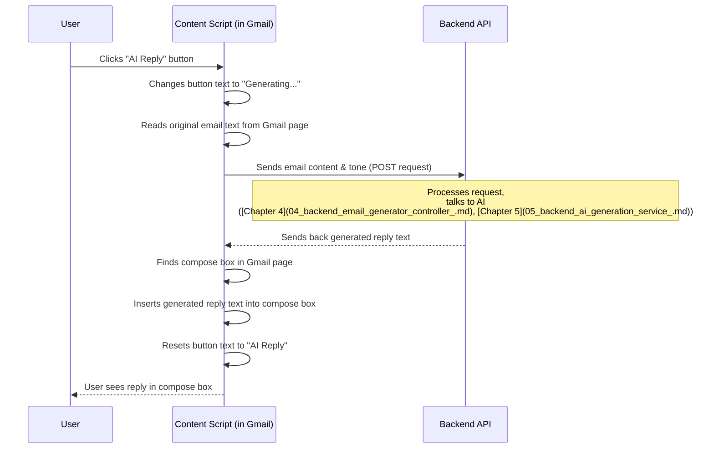

# Chapter 2: Browser Extension Content Script

Welcome back to the tutorial! In the [previous chapter](01_frontend_web_application__react__.md), we learned about the **Frontend Web Application**, which is a separate webpage where you can paste email content and get an AI reply.

Now, imagine you're in Gmail reading an email. Copying the email text, going to our separate web app, pasting it, generating, copying the reply, and coming back to paste it in Gmail can feel like a lot of steps! Wouldn't it be much easier if the AI Assistant was right there, *inside* Gmail, when you're writing a reply?

That's exactly the problem the **Browser Extension Content Script** solves!

## What is a Content Script?

Think of a browser extension like a tiny program that adds features to your web browser. Some extensions change how pages look, others add new buttons, and some interact with the page content itself.

A **Content Script** is a special type of JavaScript file that is part of a browser extension. Unlike regular scripts that run *only* within the extension's own pages, a content script runs directly *inside* the webpage you are visiting – in our case, the Gmail page!

It's like having a little helper tool that can see and interact with the Gmail page's elements (like buttons, text areas, etc.) just like you do, but programmatically.

## What Does Our Content Script Do?

Our Content Script (`AiEmail-writer-ext/content.js`) has a few key jobs when you're viewing a Gmail tab:

1.  **Watch for the Compose/Reply Window:** Gmail is a complex website that changes dynamically (compose boxes pop up, disappear, etc.). The script needs to detect *when* a compose or reply window appears.
2.  **Inject an "AI Reply" Button:** Once a compose window is found, the script needs to add our custom "AI Reply" button to the toolbar.
3.  **Listen for Clicks:** It waits for you to click the new "AI Reply" button.
4.  **Extract Email Content:** When clicked, it finds the original email thread text (the message you are replying to) within the Gmail page.
5.  **Send Content to Backend:** It takes the extracted email text and sends it to our backend API (the same one used by the frontend app).
6.  **Receive Reply:** It waits for the backend to send back the AI-generated reply.
7.  **Insert Reply:** It finds the compose box (where you type) and automatically inserts the generated reply text there.

In short, it brings the power of the AI Email Assistant directly into your Gmail workflow.

## How Does It Work Inside Gmail?

Let's look at the core logic inside `AiEmail-writer-ext/content.js`.

Because Gmail's interface loads dynamically (parts appear and disappear), our script can't just run once when the page loads and expect to find the compose box. It needs to *watch* for changes. This is done using something called a `MutationObserver`.

```javascript
// AiEmail-writer-ext/content.js (Simplified)
// This part watches the entire page for changes
const observer = new MutationObserver((mutations) => {
    for(const mutation of mutations) {
        const addedNodes = Array.from(mutation.addedNodes);
        // Check if any newly added elements look like a compose window
        const hasComposeElements = addedNodes.some(node =>
            node.nodeType === Node.ELEMENT_NODE && 
            (node.matches('.aDh, .btC, [role="dialog"]') || node.querySelector('.aDh, .btC, [role="dialog"]'))
        );

        if (hasComposeElements) {
            console.log("Compose Window Detected");
            // Wait a brief moment, then try to add the button
            setTimeout(injectButton, 500); 
        }
    }
});

// Tell the observer to start watching the main part of the page
observer.observe(document.body, {
    childList: true, // Watch for elements being added or removed
    subtree: true    // Watch inside all elements
});
```
This `MutationObserver` is like a persistent lookout. It watches the page (`document.body`) for any changes (`childList`, `subtree`). When it sees new elements appearing that match patterns of a Gmail compose window, it calls the `injectButton` function after a small delay (`setTimeout`). This delay gives Gmail's own elements time to fully appear.

Now, let's look at `injectButton`.

### Injecting the Button

The `injectButton` function first tries to find the compose toolbar where we want to place our button. It uses `findComposeToolbar` which looks for specific elements that Gmail uses for its toolbars.

```javascript
// AiEmail-writer-ext/content.js (Simplified)
function findComposeToolbar() {
    const selectors = [
        '.btC', // Common class for toolbars
        '.aDh', // Another common class
        '[role="toolbar"]', // HTML attribute indicating a toolbar
        '.gU.Up' // More Gmail specific classes
    ];
    for (const selector of selectors) {
        const toolbar = document.querySelector(selector);
        if (toolbar) {
            return toolbar; // Found it!
        }
    }
    return null; // Didn't find it
}

function injectButton() {
    // ... (code to remove existing button if any) ...

    const toolbar = findComposeToolbar(); // Find the toolbar
    if (!toolbar) {
        console.log("Toolbar not found");
        return; // Stop if no toolbar is found
    }

    console.log("Toolbar found, creating AI button");
    const button = createAIButton(); // Create our button element
    button.classList.add('ai-reply-button'); // Add a class for styling

    // ... (code to add click listener - explained next) ...

    // Add the button to the toolbar
    toolbar.insertBefore(button, toolbar.firstChild); 
}

function createAIButton() {
   const button = document.createElement('div'); // Create a new HTML div element
   button.className = 'T-I J-J5-Ji aoO v7 T-I-atl L3'; // Add Gmail's button classes
   button.style.marginRight = '8px'; // Add some spacing
   button.innerHTML = 'AI Reply'; // Set the button text
   button.setAttribute('role','button'); // Make it behave like a button
   button.setAttribute('data-tooltip','Generate AI Reply'); // Add a tooltip
   return button;
}
```
The `createAIButton` function simply creates a new HTML `div` element that looks and acts like a Gmail button by copying some of Gmail's own class names and attributes, and adding our text.

`injectButton` uses `findComposeToolbar` to locate the right spot and then uses `toolbar.insertBefore(...)` to place the new button at the beginning of the toolbar.

The styling for the button (making it blue, setting padding, etc.) comes from the `AiEmail-writer-ext/content.css` file, which is also injected into the Gmail page by the browser extension.

```css
/* AiEmail-writer-ext/content.css (Simplified) */
.ai-reply-button {
    background-color: #0b57d0 !important; /* Blue color */
    color: white !important; /* White text */
    border-radius: 16px !important; /* Rounded corners */
    /* ... other styles ... */
}
```
This CSS makes our injected button blend in nicely with Gmail's look.

### Handling the Button Click

The most important part of the button is what happens when you click it. This logic is attached to the button using an `addEventListener` inside the `injectButton` function:

```javascript
// AiEmail-writer-ext/content.js (Inside injectButton function)
button.addEventListener('click', async () => {
    try {
        // 1. Indicate loading state
        button.innerHTML = 'Generating...';
        button.disabled = true; // Disable button

        // 2. Extract email content
        const emailContent = getEmailContent(); // Get the text of the original email

        // 3. Send content to backend API
        const response = await fetch('https://aiemail-backend.onrender.com/api/email/generate', {
            method: 'POST',
            headers: {
                'Content-Type': 'application/json',
            },
            body: JSON.stringify({
                emailContent: emailContent,
                tone: "professional" // We'll use a default tone for the extension
            })
        });

        // Check if the API request was successful
        if (!response.ok) {
            throw new Error('API Request Failed');
        }

        // 4. Receive and process the reply
        const generatedReply = await response.text();

        // 5. Insert the reply into the compose box
        const composeBox = document.querySelector('[role="textbox"][g_editable="true"]');
        if (composeBox) {
            composeBox.focus(); // Put cursor in the box
            // Use execCommand to insert text where the cursor is
            document.execCommand('insertText', false, generatedReply); 
        } else {
            console.error('Compose box was not found');
        }

    } catch (error) {
        // Handle errors
        console.error(error);
        alert('Failed to generate reply');
    } finally {
        // 6. Reset button state regardless of success or failure
        button.innerHTML = 'AI Reply';
        button.disabled =  false; 
    }
});
```
Let's break down this click handler, which is an `async` function because it waits for the network request:

1.  **Loading State:** It immediately changes the button text to "Generating..." and disables it to show the user something is happening.
2.  **Get Email Content:** It calls `getEmailContent()`. This function is similar to `findComposeToolbar`, looking for specific parts of the Gmail page that contain the original message text (`.h7`, `.a3s.aiL`, etc.) and grabbing the text from there.
3.  **Send to Backend:** This is where it talks to the [Backend Email Generator Controller](04_backend_email_generator_controller_.md). It uses the browser's built-in `fetch` function to send a `POST` request to the same API URL (`https://aiemail-backend.onrender.com/...`) we saw in Chapter 1. It sends the extracted `emailContent` and a default `tone` (like "professional") in the request body, formatted as JSON.
4.  **Process Reply:** `await fetch(...)` pauses until the backend responds. `await response.text()` then reads the response body (which should be the generated reply text).
5.  **Insert Reply:** It finds the main compose text area using `document.querySelector('[role="textbox"][g_editable="true"]')`. If found, it puts the cursor in the box (`composeBox.focus()`) and then uses `document.execCommand('insertText', ...)` to paste the generated reply text where the cursor is. `execCommand` is an older web API but is often used in content scripts to interact with rich text editors like Gmail's compose box.
6.  **Reset State:** The `finally` block ensures that, whether the process succeeded or failed, the button text is reset to "AI Reply" and the button is re-enabled.
7.  **Error Handling:** The `try...catch` block catches any errors (like the network request failing) and logs them, also showing a simple alert to the user.

Here's a simple sequence diagram showing the process when the button is clicked:



## Conclusion

The **Browser Extension Content Script** (`content.js`) is the key piece that allows our AI Email Assistant to live directly inside Gmail. By using techniques like `MutationObserver` to watch for Gmail's dynamic interface changes, finding specific elements using selectors, injecting custom HTML and CSS, and using `fetch` to communicate with our backend API, it seamlessly integrates the AI generation functionality into your email writing workflow.

Now that we understand what the content script does and how it interacts with the Gmail page, we need to learn how the browser knows *when* and *where* to inject this script. That's the job of the Browser Extension Manifest file.

---

<sub><sup>**References**: [[1]](https://github.com/Kvr-10/AiEmail-Assistant/blob/36ea59027bf79772edbe65880185d2d6e816b158/AiEmail-writer-ext/content.css), [[2]](https://github.com/Kvr-10/AiEmail-Assistant/blob/36ea59027bf79772edbe65880185d2d6e816b158/AiEmail-writer-ext/content.js)</sup></sub>

---