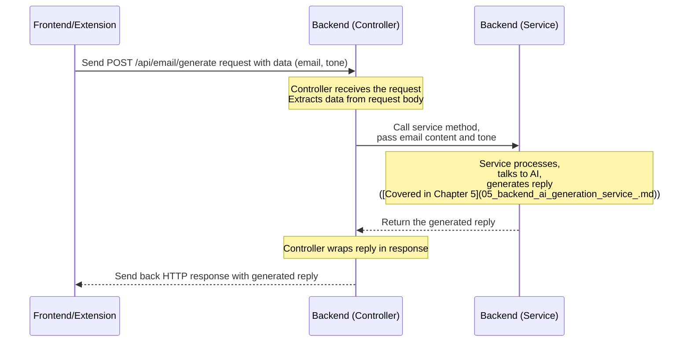

# Chapter 4: Backend Email Generator Controller

Welcome to Chapter 4! In the previous chapters, we focused on the user-facing parts of our Ai Email Assistant: the [Frontend Web Application](01_frontend_web_application__react__.md) (Chapter 1) where you interact via a webpage, and the [Browser Extension Content Script](02_browser_extension_content_script_.md) (Chapter 2) which injects functionality directly into Gmail, configured by the [Browser Extension Manifest](03_browser_extension_manifest_.md) (Chapter 3).

We saw how both the frontend web app and the browser extension needed to send information (like the original email content and desired tone) to our **backend** – the part of the application that does the heavy lifting, including talking to the AI.

But how does the backend *receive* these requests? Where do they land first? That's the job of the **Backend Email Generator Controller**.

## What Problem Does the Controller Solve?

Imagine our backend application is like a busy office building. Different departments handle different tasks (one might talk to the AI, another might save things to a database, etc.).

When a request arrives from the outside world (like from our frontend web app or browser extension asking to generate an email), someone needs to be at the **entrance** to:

1.  **Receive** the incoming request.
2.  **Understand** what the request is asking for (e.g., "Please generate an email!").
3.  **Gather** the necessary information included in the request (e.g., the email content and tone).
4.  **Direct** that request, along with the information, to the correct "department" inside the office that can actually *do* the work (in our case, the department that talks to the AI).

The **Backend Email Generator Controller** acts exactly like this **receptionist** or **entry point** for our backend. It's the first piece of code that handles specific types of incoming web requests related to generating emails.

## What is the Controller Built With?

Our backend is built using **Spring Boot**, a popular framework for building Java applications, especially web applications and APIs. Spring Boot makes it easier and faster to create the kind of server-side logic we need.

Within Spring Boot, the concept of a **Controller** is specifically designed to handle incoming HTTP requests (like the GET and POST requests your browser makes).

Our `EmailGeneratorController` uses specific Spring Boot features (called **annotations**) to tell the framework how to route requests to the correct method within the controller.

## How Do We Use the Controller (from the Frontend's Perspective)?

From the perspective of the frontend (the web app or extension), they "use" the controller by sending an HTTP POST request to a specific address (URL).

As we saw in Chapter 1 and 2, both frontend parts send a request to:

`https://aiemail-backend.onrender.com/api/email/generate`

They send this request using the `POST` method and include the email content and tone in the **body** of the request, typically formatted as JSON.

```json
{
  "emailContent": "Hello, thanks for your email...",
  "tone": "friendly"
}
```
This incoming POST request carrying this JSON data is what the `EmailGeneratorController` is waiting to receive.

## Key Concepts of the Controller

Let's break down the main concepts we'll see in the controller code:

| Concept             | Analogy                 | What it does                                                 | Spring Boot Annotation/Feature |
| :------------------ | :---------------------- | :----------------------------------------------------------- | :----------------------------- |
| **Controller**      | The Receptionist        | A class that handles incoming web requests.                  | `@RestController`              |
| **Request Mapping** | The Receptionist's Desk | Defines the base URL path this controller handles.           | `@RequestMapping("/api/email")`|
| **Endpoint Method** | A Specific Counter      | A method within the controller that handles a specific URL and HTTP method (like POST to `/generate`). | `@PostMapping("/generate")`    |
| **Request Body**    | The Information Parcel  | Represents the data sent *with* the request (like the JSON with email content and tone). | `@RequestBody`                 |
| **Dependency Injection** | Calling a Department  | How the controller gets access to other necessary components (like the service that does the AI work). | `@Autowired` or Constructor |
| **Response Entity** | The Reply Envelope      | How the controller wraps the result to send back to the client. | `ResponseEntity`               |

## How It Works Inside (The Workflow)

When a request comes in, here's the simplified flow managed by the controller:


The controller is the mediator: it takes the request from the outside, passes it to the internal "service" department for processing, gets the result back, and sends it out as the response.

## Code Deep Dive: EmailGeneratorController.java

Let's look at the actual code for the controller. This file is located at `AIEmail-writer/src/main/java/io/github/kvr_10/AIEmail_writer/app/EmailGeneratorController.java`.

First, every Spring Boot application needs a main class to start it. Ours is very simple:

```java
// File: AIEmail-writer/src/main/java/io/github/kvr_10/AIEmail_writer/AiEmailWriterApplication.java
package io.github.kvr_10.AIEmail_writer;

import org.springframework.boot.SpringApplication;
import org.springframework.boot.autoconfigure.SpringBootApplication;

@SpringBootApplication // This annotation tells Spring Boot this is the main app class
public class AiEmailWriterApplication {

    public static void main(String[] args) {
        // This starts the Spring Boot application
        SpringApplication.run(AiEmailWriterApplication.class, args);
    }
}
```
The `@SpringBootApplication` annotation is powerful; it sets up a lot of defaults and scanning. The `main` method is the standard Java entry point, and `SpringApplication.run` kicks everything off.

Now, let's look at the controller class itself:

```java
// File: AIEmail-writer/src/main/java/io/github/kvr_10/AIEmail_writer/app/EmailGeneratorController.java
package io.github.kvr_10.AIEmail_writer.app;

import lombok.AllArgsConstructor; // Helps create a constructor easily
import org.springframework.http.ResponseEntity; // Used for sending back HTTP responses
import org.springframework.web.bind.annotation.*; // Contains most Spring Web annotations

@RestController // 1. This class handles web requests and returns data directly
@RequestMapping("/api/email") // 2. All endpoints in this class start with /api/email
@AllArgsConstructor // 3. Creates a constructor that Spring uses for dependency injection
public class EmailGeneratorController {

    // 4. This is the "service" department we will send requests to
    private final EmailGeneratorService emailGeneratorService;

    // ... methods below
}
```
Let's break down the annotated lines:

1.  `@RestController`: This is a special type of controller in Spring. It means that whatever this controller's methods return should be sent back as the response body directly to the client (browser/extension), rather than returning the name of a webpage template to render.
2.  `@RequestMapping("/api/email")`: This annotation on the class means that any endpoint defined *inside* this controller will have `/api/email` as its base path. So, if a method has `@PostMapping("/generate")`, its full path will be `/api/email/generate`.
3.  `@AllArgsConstructor`: This comes from the Lombok library (which is often used with Spring Boot to reduce boilerplate code). It automatically creates a constructor for the class that includes all the fields declared as `final` (like `emailGeneratorService`). Spring Boot uses this constructor to automatically *inject* the required `EmailGeneratorService` when it creates an instance of this controller. This is the "Calling a Department" concept – the controller doesn't create the service itself; Spring provides it ready to go.
4.  `private final EmailGeneratorService emailGeneratorService;`: This declares a field for the `EmailGeneratorService`. The `final` keyword means it must be initialized, which happens via the constructor generated by `@AllArgsConstructor`. Spring Boot finds the available `EmailGeneratorService` component and provides it here. We'll learn what the `EmailGeneratorService` does in [Chapter 5](05_backend_ai_generation_service_.md).

Now, let's look at the main method that handles the email generation request:

```java
// File: AIEmail-writer/src/main/java/io/github/kvr_10/AIEmail_writer/app/EmailGeneratorController.java
// ... class declaration and field above

    @PostMapping("/generate") // 5. This method handles POST requests specifically to /api/email/generate
    public ResponseEntity<String> generateEmail(@RequestBody EmailRequest emailRequest){
        // 6. @RequestBody tells Spring to convert the incoming request body (JSON)
        //    into an EmailRequest object.
        //    EmailRequest is a simple data structure defined in Chapter 6.

        // 7. Pass the request data to the service layer (the department that does the work)
        String response = emailGeneratorService.generateEmailReply(emailRequest);

        // 8. Wrap the service's result in a successful HTTP response (status 200 OK)
        return ResponseEntity.ok(response);
    }

    // ... other methods below
}
```
Breaking this down:

5.  `@PostMapping("/generate")`: This annotation maps HTTP POST requests arriving at `/api/email/generate` to this specific `generateEmail` method.
6.  `@RequestBody EmailRequest emailRequest`: This is where the incoming data parcel is received. `@RequestBody` is a Spring annotation that automatically takes the body of the incoming HTTP request (which we expect to be JSON like `{ "emailContent": "...", "tone": "..." }`) and tries to convert it into a Java object of type `EmailRequest`. We will look at the simple `EmailRequest` class in [Chapter 6](06_email_request_data_model_.md). So, when a POST request arrives at `/api/email/generate` with the JSON data, Spring creates an `EmailRequest` object for us and passes it into this method as the `emailRequest` variable.
7.  `String response = emailGeneratorService.generateEmailReply(emailRequest);`: This is the core action of the controller method. It takes the `emailRequest` object (which now holds the email content and tone) and passes it to the `emailGeneratorService` instance (the "service department"). It calls the `generateEmailReply` method on this service and waits for the `String` result (the generated reply).
8.  `return ResponseEntity.ok(response);`: Once the service returns the generated reply, the controller needs to send it back to the client. `ResponseEntity.ok(response)` is a convenient way in Spring to create an HTTP response. `ResponseEntity.ok()` specifically creates a response with a status code of 200 OK (meaning success) and sets the provided `response` string as the body of the HTTP response.

## Other Simple Endpoints

Our controller also includes a couple of simple GET endpoints. These aren't used by the frontend for generation but are helpful for checking if the backend application is running.

```java
// File: AIEmail-writer/src/main/java/io/github/kvr_10/AIEmail_writer/app/EmailGeneratorController.java
// ... generateEmail method above

    @GetMapping("/") // This method handles GET requests to /api/email/
    public String home(){
        // Returns a simple string
        return "The Application is running";
    }

    @GetMapping("/generate") // This method handles GET requests to /api/email/generate
    public String generate(){
        // Returns a different simple string
        return "Application's backend is running,run the frontend!";
    }
}
```
*   `@GetMapping("/")`: This maps HTTP GET requests to the base path of the controller, which is `/api/email/`.
*   `@GetMapping("/generate")`: This maps HTTP GET requests to `/api/email/generate`. Notice this is the *same path* as the POST endpoint, but because it uses `@GetMapping` instead of `@PostMapping`, Spring knows to route GET requests to this method and POST requests to the `generateEmail` method.

These methods simply return a `String`. Because the class is annotated with `@RestController`, Spring sends these strings back as the body of the HTTP response. You can visit these URLs in your browser to see these messages, confirming the backend is online.

## Conclusion

The **Backend Email Generator Controller** is the crucial **entry point** for our application's backend. Built with Spring Boot and using annotations like `@RestController`, `@RequestMapping`, `@PostMapping`, and `@RequestBody`, it effectively acts as a **receptionist**: receiving incoming HTTP requests from the frontend and browser extension, extracting the necessary data (email content and tone), and correctly forwarding the request to the internal "service" department (`EmailGeneratorService`) that will handle the AI interaction and generation. It then receives the generated reply from the service and sends it back as the HTTP response.

Now that we know how requests arrive at the backend and where they are directed, let's delve into that "service" department to see how the actual AI magic happens.

---

<sub><sup>**References**: [[1]](https://github.com/Kvr-10/AiEmail-Assistant/blob/36ea59027bf79772edbe65880185d2d6e816b158/AIEmail-writer/src/main/java/io/github/kvr_10/AIEmail_writer/AiEmailWriterApplication.java), [[2]](https://github.com/Kvr-10/AiEmail-Assistant/blob/36ea59027bf79772edbe65880185d2d6e816b158/AIEmail-writer/src/main/java/io/github/kvr_10/AIEmail_writer/app/EmailGeneratorController.java)</sup></sub>

---