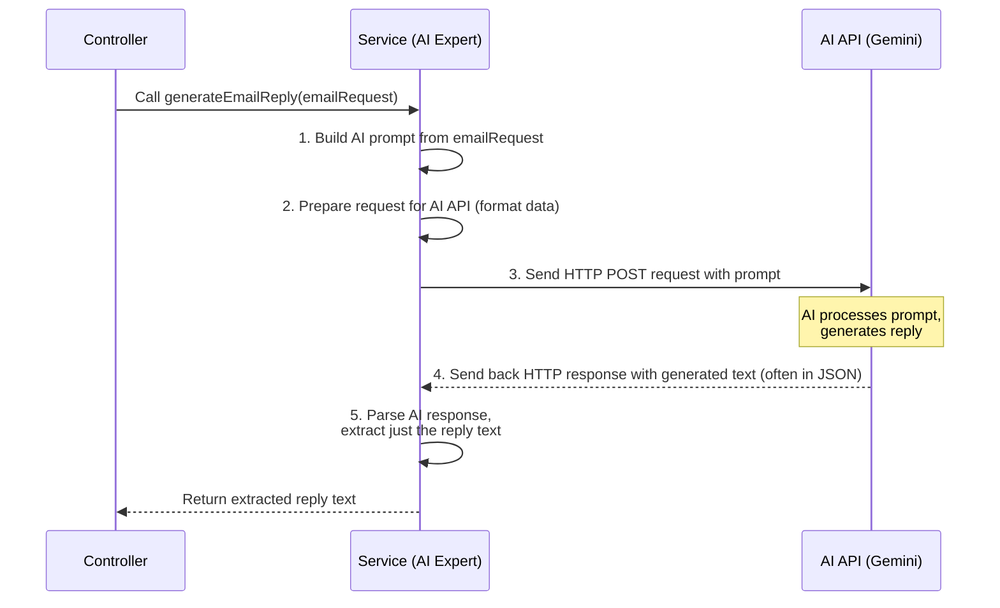

# Chapter 5: Backend AI Generation Service

Welcome back! In the [previous chapter](04_backend_email_generator_controller_.md), we learned about the **Backend Email Generator Controller**. This controller acts as the backend's "receptionist," receiving requests from the frontend and directing them to the right place.

But the controller doesn't *actually* talk to the AI itself. Its job is just to receive the request and pass it on. So, who does the complex work of interacting with the AI model, sending the prompt, and getting the reply?

That's the role of the **Backend AI Generation Service**!

## What Problem Does the AI Generation Service Solve?

Think of the controller as the person at the front desk, and the AI Generation Service as the **expert consultant** or the **specialized department** within our backend "office."

When the receptionist (the controller) gets a request saying, "Here's an email and a tone, please get an AI reply!", they don't try to call the AI directly. Instead, they pass that request to the AI Generation Service department.

This service department is the *only* one in the backend that knows:

1.  Exactly **how to format the question** (the "prompt") in a way the specific AI model (like Gemini) understands.
2.  **Where** the AI model's API lives on the internet.
3.  **How to send a request** to that API (using the right tools and keys).
4.  **How to read and understand** the response that comes back from the AI, which might be in a complex format.
5.  **How to extract just the useful part** (the generated email reply) from that response.

So, the **Backend AI Generation Service** is the core intelligence module on the backend responsible for the direct communication and handling of the AI interaction. It hides the complexity of talking to the AI from other parts of the application.

## What is the Service Built With?

Just like the controller, our AI Generation Service is part of the Spring Boot backend application. It's a regular Java class but marked with a special Spring annotation:

*   **`@Service`**: This Spring annotation marks a class as a "service component." It indicates that this class holds business logic or performs specific tasks (like interacting with an external API). When Spring scans your application, it finds `@Service` classes and makes them available to be "injected" into other components (like our controller, which needed an `EmailGeneratorService`).

Inside the service, the key tool for talking to the external AI API is:

*   **`WebClient`**: This is a modern, flexible way in Spring to make HTTP requests (like GET, POST) to other servers on the internet. It's like the service's **internet-enabled phone** it uses to dial the AI API's number and send messages.

The service also needs some configuration values, like the AI API's address and your secret API key. It gets these using:

*   **`@Value`**: This Spring annotation allows you to inject values from configuration files (like `application.properties`, which we'll cover in [Chapter 7](07_backend_application_properties_.md)) or environment variables directly into your class fields.

## How Does the Service Work Inside?

When the `EmailGeneratorController` receives a request and calls the `generateEmailReply` method on the `EmailGeneratorService`, here's a simplified step-by-step process:



## Code Deep Dive: EmailGeneratorService.java

Let's look at the code for the service, located at `AIEmail-writer/src/main/java/io/github/kvr_10/AIEmail_writer/app/EmailGeneratorService.java`.

First, the class declaration and fields:

```java
// File: AIEmail-writer/src/main/java/io/github/kvr_10/AIEmail_writer/app/EmailGeneratorService.java
package io.github.kvr_10.AIEmail_writer.app;

import com.fasterxml.jackson.databind.JsonNode; // Used to parse JSON from AI
import com.fasterxml.jackson.databind.ObjectMapper; // Used to parse JSON from AI
import org.springframework.beans.factory.annotation.Value; // To get config values
import org.springframework.stereotype.Service; // Marks this as a service component
import org.springframework.web.reactive.function.client.WebClient; // To make HTTP requests

import java.util.Map; // Used to build the AI request body

@Service // 1. Tells Spring this is a service component
public class EmailGeneratorService {

    private final WebClient webClient; // 2. The tool for making web requests

    @Value("${gemini.api.url}") // 3. Get the AI API URL from configuration
    private String geminiApiUrl;

    @Value("${gemini.api.key}") // 4. Get the AI API key from configuration
    private String geminiApiKey;

    // 5. Constructor for Spring to inject WebClient
    public EmailGeneratorService(WebClient.Builder webClientBuilder) {
        this.webClient = webClientBuilder.build();
    }

    // ... methods below
}
```
1.  `@Service`: Marks this class as a service managed by Spring. This allows Spring to create an instance of it and inject it where needed (like in our controller).
2.  `private final WebClient webClient;`: Declares the `WebClient` instance we will use. `final` means it's set once in the constructor.
3.  `@Value("${gemini.api.url}")`: This annotation tells Spring to look up the value associated with the key `gemini.api.url` in our application's configuration (like `application.properties`) and assign it to this `geminiApiUrl` variable. The `${...}` syntax is how `@Value` references configuration keys.
4.  `@Value("${gemini.api.key}")`: Does the same for the AI API key.
5.  `public EmailGeneratorService(WebClient.Builder webClientBuilder)`: This is the constructor. Spring Boot often automatically provides a configured `WebClient.Builder`. By accepting it here, Spring injects the builder, and we use `webClientBuilder.build()` to create our `webClient` instance.

Next, let's look at the main method called by the controller: `generateEmailReply`.

```java
// File: AIEmail-writer/src/main/java/io/github/kvr_10/AIEmail_writer/app/EmailGeneratorService.java
// ... fields and constructor above

    public String generateEmailReply(EmailRequest emailRequest) {
        // 1. Build the prompt (the question for the AI)
        String prompt = buildPrompt(emailRequest);
        System.out.println("Sending prompt to AI: " + prompt); // Log the prompt (helpful for debugging)


        // 2. Craft the request body structure expected by the AI API
        Map<String, Object> requestBody = Map.of(
                "contents", new Object[] { // AI APIs often expect data in specific JSON formats
                        Map.of("parts", new Object[]{
                                Map.of("text", prompt) // Put our prompt text here
                        })
                }
        );

        // 3. Use WebClient to send the POST request to the AI API
        String response = webClient.post() // Start a POST request
                .uri(geminiApiUrl + geminiApiKey) // Set the full API endpoint URL (URL + Key)
                .header("Content-Type","application/json") // Tell the AI API we're sending JSON
                .bodyValue(requestBody) // Set the crafted request body
                .retrieve() // Send the request and get the response back
                .bodyToMono(String.class) // Expect the response body as a String
                .block(); // Wait synchronously for the response (simple for this example)

        // 4. Extract the actual reply text from the response String
        return extractResponseContent(response);
    }

    // ... other methods below
}
```
Let's break down the steps within `generateEmailReply`:

1.  `String prompt = buildPrompt(emailRequest);`: It calls a helper method `buildPrompt` to create the text that will be sent to the AI. This method takes the `EmailRequest` object (with email content and tone) and formats it into a clear instruction for the AI. We'll look at `buildPrompt` next.
2.  `Map<String, Object> requestBody = Map.of(...)`: AI APIs expect the data (the prompt) in a specific JSON structure. This code builds a Java `Map` that mirrors the required JSON structure for the Gemini API. This map will be automatically converted to JSON by `WebClient`.
3.  `webClient.post()...block()`: This chain of calls uses `WebClient` to perform the crucial action:
    *   `.post()`: Specifies that this will be an HTTP POST request.
    *   `.uri(geminiApiUrl + geminiApiKey)`: Sets the destination URL. It combines the base URL from configuration with the API key (this is common for simple API key authentication).
    *   `.header("Content-Type","application/json")`: Adds an HTTP header telling the server that the data being sent in the body is in JSON format.
    *   `.bodyValue(requestBody)`: Sets the body of the request, which is the `Map` we created containing the prompt. `WebClient` automatically converts this Map into JSON.
    *   `.retrieve()`: Executes the request and gets the response.
    *   `.bodyToMono(String.class)`: Specifies that we want to get the response body back as a single `String` (Mono means single item, String.class means we expect String).
    *   `.block()`: `WebClient` is typically used asynchronously, but `.block()` is used here for simplicity in this basic example. It pauses the current execution until the response is received. The response body is then stored in the `response` String variable.
4.  `return extractResponseContent(response);`: The raw response from the AI API is a JSON string that contains more than just the reply (like safety ratings, metadata). This calls a helper method `extractResponseContent` to parse this JSON and get *only* the generated text reply. We'll look at this next.

Now, let's see the helper methods: `buildPrompt` and `extractResponseContent`.

### Building the Prompt (`buildPrompt` method)

```java
// File: AIEmail-writer/src/main/java/io/github/kvr_10/AIEmail_writer/app/EmailGeneratorService.java
// ... generateEmailReply method above

    private String buildPrompt(EmailRequest emailRequest) {
        StringBuilder prompt = new StringBuilder();
        String statement = "Generate a professional and polite email reply to the following email content." +
                "Ensure that the response addresses all key points in the original email while maintaining a " +
                "courteous tone. Keep it concise, relevant, and clear. Do not include a subject line";
        prompt.append(statement); // Start with the main instruction

        // Add the tone instruction if one was provided
        if (emailRequest.getTone() != null && !emailRequest.getTone().isEmpty()) {
            prompt.append("Use a ").append(emailRequest.getTone()).append(" tone.");
        }

        // Add the original email content that the AI needs to reply to
        prompt.append("\nOriginal email: \n").append(emailRequest.getEmailContent());

        return prompt.toString(); // Return the complete prompt string
    }

    // ... extractResponseContent method below
}
```
This method is crucial because **how you phrase the prompt significantly affects the AI's output**. It constructs a single string containing instructions for the AI.

*   It starts with a base instruction (`statement`) asking for a professional and polite reply, mentioning key points, tone, conciseness, and specifically telling it *not* to include a subject line (because we just want the body text).
*   It checks if the `emailRequest` has a tone specified (like "friendly" or "casual"). If so, it adds an extra sentence telling the AI to use that specific tone.
*   Finally, it adds the actual original email content, often clearly labeled, so the AI knows what to reply to.

The resulting `prompt` string is what gets sent to the AI API.

### Extracting the Response (`extractResponseContent` method)

```java
// File: AIEmail-writer/src/main/java/io/github/kvr_10/AIEmail_writer/app/EmailGeneratorService.java
// ... buildPrompt method above

    private String extractResponseContent(String response) {
        try {
            ObjectMapper mapper = new ObjectMapper(); // Tool to parse JSON strings
            JsonNode rootNode = mapper.readTree(response); // Parse the response string into a JSON structure (tree)

            // Navigate through the JSON tree to find the actual text content
            return rootNode.path("candidates") // Go to the "candidates" array
                    .get(0) // Get the first item in the array (usually the main response)
                    .path("content") // Go to the "content" object
                    .path("parts") // Go to the "parts" array
                    .get(0) // Get the first item in the array
                    .path("text") // Go to the "text" field
                    .asText(); // Get the value of the "text" field as a String

        } catch (Exception e) {
            // If anything goes wrong (e.g., response format is unexpected)
            System.err.println("Error parsing AI response: " + e.getMessage());
            e.printStackTrace(); // Print error details to console
            return "Error processing request: Failed to get text from AI response."; // Return an error message
        }
    }
}
```
AI APIs usually return responses in a structured format, often JSON. This method is responsible for navigating this structure to pull out *just* the generated text reply.

*   `ObjectMapper mapper = new ObjectMapper();`: Creates an object from the Jackson library, which is commonly used in Java for working with JSON.
*   `JsonNode rootNode = mapper.readTree(response);`: Takes the incoming `response` string (which is JSON) and parses it into a `JsonNode`, which represents the root of the JSON structure. We can then navigate this `JsonNode` like a tree.
*   `.path("candidates").get(0).path("content").path("parts").get(0).path("text").asText()`: This chain of calls is specific to the structure of the response from the Gemini API. It's like following a path through the JSON: "Go into the 'candidates' list, get the first item, then go into its 'content', then its 'parts' list, get the first item, then get the value of the 'text' field, and give it to me as text."
*   `try...catch`: This block handles potential errors. If the AI's response isn't in the expected format, trying to navigate the JSON tree might fail. The `catch` block catches any exception, prints an error, and returns a user-friendly error message instead of crashing.

This method effectively takes the potentially complex AI response and boils it down to the simple `String` containing the generated email reply that the controller expects.

## Conclusion

The **Backend AI Generation Service** is the true workhorse of our backend when it comes to interacting with the AI. It receives the processed request data from the controller, knows exactly how to ask the AI the right question by building a formatted prompt, uses `WebClient` to communicate with the external AI API (handling the details like URLs, keys, and request format), and finally processes the AI's response to extract the generated email reply. It shields the rest of the application from the complexities of the AI API, providing a clean method (`generateEmailReply`) that simply takes the email request details and returns the generated text.

Now that we've seen how the controller receives data and the service processes it by talking to the AI, let's take a quick look at the simple data structure (`EmailRequest`) that is passed between them.

---

<sub><sup>**References**: [[1]](https://github.com/Kvr-10/AiEmail-Assistant/blob/36ea59027bf79772edbe65880185d2d6e816b158/AIEmail-writer/src/main/java/io/github/kvr_10/AIEmail_writer/app/EmailGeneratorService.java), [[2]](https://github.com/Kvr-10/AiEmail-Assistant/blob/36ea59027bf79772edbe65880185d2d6e816b158/AIEmail-writer/src/main/resources/application.properties)</sup></sub>

---