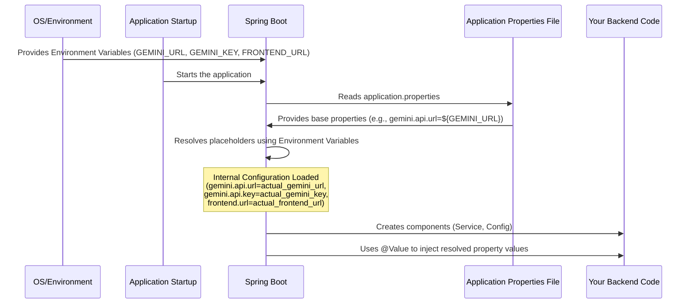

# Chapter 7: Backend Application Properties

Welcome back! In our journey through the Ai Email Assistant, we've explored the user interfaces ([Frontend Web Application (React)](01_frontend_web_application__react__.md) and [Browser Extension Content Script](02_browser_extension_content_script_.md) configured by the [Browser Extension Manifest](03_browser_extension_manifest_.md)), the backend's entry point ([Backend Email Generator Controller](04_backend_email_generator_controller_.md)), the core AI interaction logic ([Backend AI Generation Service](05_backend_ai_generation_service_.md)), and the structure of the data requests ([Email Request Data Model](06_email_request_data_model_.md)).

In the [Backend AI Generation Service](05_backend_ai_generation_service_.md) chapter, you might have noticed something like this:

```java
// Inside EmailGeneratorService.java
@Value("${gemini.api.url}") // Get the AI API URL from configuration
private String geminiApiUrl;

@Value("${gemini.api.key}") // Get the AI API key from configuration
private String geminiApiKey;
```
These `@Value` annotations look like they are pulling information from somewhere using names like `${gemini.api.url}`. But where do these values actually come from? And why do we get them this way instead of just writing the URL and key directly in the code?

That's exactly what the **Backend Application Properties** file is for!

## What Problem Does the Application Properties File Solve?

Imagine you're writing a recipe. You might list the ingredients needed. But you wouldn't write "Get flour from the pantry at address 123 Main St" directly in the recipe steps. Instead, you just say "1 cup flour" and assume you know *where* to get flour. The exact *location* of the flour might change (different store, moved pantry), but the recipe itself doesn't need to change.

Our backend application needs "ingredients" too, like:

*   The internet address (URL) of the AI service it needs to talk to.
*   The secret key needed to access that AI service.
*   The address (URL) of the frontend web application.

These "ingredients" (configuration values) can change depending on where you run the application (your local computer, a test server, a production server). Also, sensitive values like API keys should *never* be written directly into the code itself because:

1.  They would be visible to anyone who sees the code.
2.  Changing them would require changing and rebuilding the code, which is inconvenient.

The **Backend Application Properties** file solves these problems by providing a dedicated place to store these configuration settings *outside* of the main code logic. It's like the **ingredients list** or **settings manual** for your backend application.

It allows you to:

*   **Configure** the application without changing the code.
*   Keep **sensitive information** (like API keys) separate, often loading them from even more secure places like environment variables.
*   Easily **change settings** when deploying to different environments (development, testing, production).

## What are Application Properties?

In Spring Boot applications, the standard place to put these external configuration settings is a file named `application.properties` or `application.yml`, usually located in the `src/main/resources` folder.

For our project, we use `application.properties`. This file uses a simple `key=value` format. Each line sets a configuration property.

When the Spring Boot application starts up, it automatically looks for and reads this file. It makes all the `key=value` pairs available to your application's code.

## How Do We Use Application Properties in This Project?

Our `application.properties` file (located at `AIEmail-writer/src/main/resources/application.properties`) looks like this:

```properties
# File: AIEmail-writer/src/main/resources/application.properties
spring.application.name=AIEmail-writer

gemini.api.url=${GEMINI_URL}
gemini.api.key=${GEMINI_KEY}
frontend.url=${FRONTEND_URL}
```

Let's break down these lines:

*   `spring.application.name=AIEmail-writer`: This is a standard Spring Boot property that gives a name to your application. It's useful for logging and monitoring.
*   `gemini.api.url=${GEMINI_URL}`: This defines a property named `gemini.api.url`. Notice the value isn't a direct URL, but `${GEMINI_URL}`. This tells Spring: "Look for an environment variable named `GEMINI_URL`, and use its value for this property." This is a common and secure way to handle values that might change or shouldn't be hardcoded.
*   `gemini.api.key=${GEMINI_KEY}`: Similarly, this defines the `gemini.api.key` property and tells Spring to get its value from an environment variable named `GEMINI_KEY`. **Using environment variables for sensitive keys like this is a security best practice.**
*   `frontend.url=${FRONTEND_URL}`: This defines the `frontend.url` property and gets its value from an environment variable named `FRONTEND_URL`. This property is needed by the backend to know which frontend addresses are allowed to communicate with it (this is related to [Cross-Origin Resource Sharing (CORS)](08_cross_origin_resource_sharing__cors__config_.md), which we'll cover in the next chapter).

So, instead of having the actual URLs and keys in this file or hardcoded in our Java code, we tell the application to *expect* them to be provided from the environment where the application is running.

## How Properties Get Into the Code

As we saw in [Chapter 5: Backend AI Generation Service](05_backend_ai_generation_service_.md), the `@Value` annotation is how the backend Java code *receives* these values from the properties.

Here's that snippet again:

```java
// Inside AIEmail-writer/src/main/java/io/github/kvr_10/AIEmail_writer/app/EmailGeneratorService.java
// ... imports ...

@Service
public class EmailGeneratorService {

    // ... other fields ...

    @Value("${gemini.api.url}") // Get the value mapped to gemini.api.url
    private String geminiApiUrl; // Spring injects the value here

    @Value("${gemini.api.key}") // Get the value mapped to gemini.api.key
    private String geminiApiKey; // Spring injects the value here

    // ... constructor and methods ...
}
```

When Spring creates an instance of `EmailGeneratorService`, it looks at the `@Value` annotations. For `${gemini.api.url}`, it goes to its internal list of properties (which it built by reading `application.properties` and environment variables) and finds the value associated with `gemini.api.url`. It then takes that value (which came from the `GEMINI_URL` environment variable) and assigns it to the `geminiApiUrl` variable in the service class. It does the same for the API key.

This means the `EmailGeneratorService` class *itself* doesn't need to know *how* or *where* the URL and key came from – it just knows that Spring has provided them via these variables, ready to be used by the `WebClient` to talk to the AI API.

Another place we use a property is in the CORS configuration:

```java
// Inside AIEmail-writer/src/main/java/io/github/kvr_10/AIEmail_writer/app/CorsConfig.java
// ... imports ...

@Configuration
public class CorsConfig {

    @Value("${frontend.url}") // Get the value mapped to frontend.url
    private String frontendUrl; // Spring injects the value here

    @Bean
    public WebMvcConfigurer corsConfigurer() {
        return new WebMvcConfigurer() {
            @Override
            public void addCorsMappings(CorsRegistry registry) {
                registry.addMapping("/**")
                        // Use the injected frontendUrl value here
                        .allowedOrigins(frontendUrl,"https://mail.google.com/") 
                        // ... other CORS settings ...
            }
        };
    }
}
```
Here, the `@Value("${frontend.url}")` annotation injects the value of the `frontend.url` property (which comes from the `FRONTEND_URL` environment variable) into the `frontendUrl` variable in the `CorsConfig` class. This variable is then used to tell Spring which origins (frontend addresses) are allowed to make requests to this backend. This is essential for the frontend web application to work when hosted on a different address than the backend.

## How It Works Internally (High-Level)

Here's a simplified view of what happens with application properties when the backend application starts:


When your application starts, Spring Boot automatically sets up an "Environment". This environment contains properties from various sources, including the `application.properties` file and system environment variables. When Spring encounters a placeholder like `${GEMINI_URL}` in the `application.properties` file, it looks up `GEMINI_URL` in its Environment. If it finds a matching environment variable, it uses that value. Finally, when Spring initializes classes that use the `@Value` annotation, it retrieves the resolved property values from the Environment and injects them into the corresponding fields.

This layering (environment variables > properties file > default values) provides flexibility and security, allowing you to override settings easily without touching code or even the properties file itself, especially for sensitive information stored in environment variables.

## Conclusion

The **Backend Application Properties** file (`application.properties`) is a fundamental configuration file in our Spring Boot backend. It serves as the central place to define external settings needed by the application, such as API URLs, keys, and the frontend address. By using placeholders like `${ENVIRONMENT_VARIABLE}` and combining this with Spring's `@Value` annotation, we can keep sensitive information secure (by storing it in environment variables) and make the application easily configurable without modifying the core code. This approach is crucial for managing settings across different development and deployment environments.

Now that we understand how the backend gets its configuration, let's look at another important configuration concept: how the backend allows requests from our frontend running on potentially different addresses.

---

<sub><sup>**References**: [[1]](https://github.com/Kvr-10/AiEmail-Assistant/blob/36ea59027bf79772edbe65880185d2d6e816b158/AIEmail-writer/src/main/java/io/github/kvr_10/AIEmail_writer/app/CorsConfig.java), [[2]](https://github.com/Kvr-10/AiEmail-Assistant/blob/36ea59027bf79772edbe65880185d2d6e816b158/AIEmail-writer/src/main/java/io/github/kvr_10/AIEmail_writer/app/EmailGeneratorService.java), [[3]](https://github.com/Kvr-10/AiEmail-Assistant/blob/36ea59027bf79772edbe65880185d2d6e816b158/AIEmail-writer/src/main/resources/application.properties)</sup></sub>

---