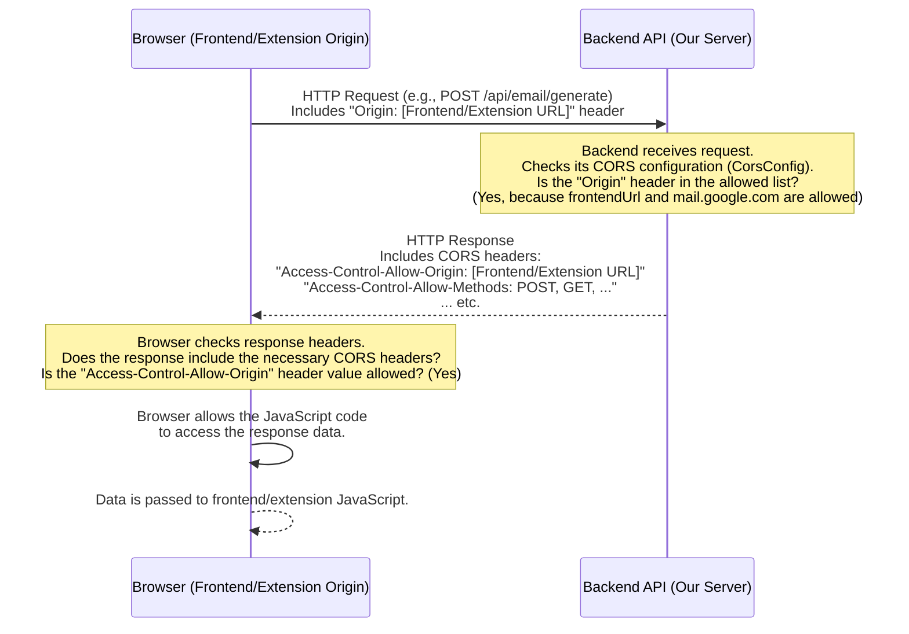

# Chapter 8: Cross-Origin Resource Sharing (CORS) Config

Welcome to the final chapter of our Ai Email Assistant tutorial! In the [previous chapter](07_backend_application_properties_.md), we learned how our backend application gets its configuration settings, like the AI API URL and the address of our frontend application, using the `application.properties` file and environment variables.

Now, we need to tackle a crucial aspect of getting our backend API to work correctly with our frontend web application and browser extension: dealing with **Cross-Origin Resource Sharing**, or **CORS**.

## What Problem Does CORS Solve (and Create for Us)?

Imagine you're building a private club, and only people from *your* neighborhood are allowed in by default. If someone from a *different* neighborhood tries to enter, the bouncer (the browser) says, "Nope, you're not from around here, you can't come in!" This is a security measure to prevent malicious websites from making requests to other sites on your behalf without permission.

In the world of web browsers and APIs, this security measure is called the **Same-Origin Policy**. By default, a web page loaded from one "origin" (like `https://my-frontend-app.netlify.app`) is **blocked** by the browser from making requests to a different "origin" (like our backend API at `https://aiemail-backend.onrender.com`).

An "origin" is defined by the combination of:
*   **Protocol:** `http` or `https`
*   **Domain:** `my-frontend-app.netlify.app` or `aiemail-backend.onrender.com` or `mail.google.com`
*   **Port:** (Usually implied by protocol, e.g., 80 for http, 443 for https)

In our project:

*   The **Frontend Web Application** is hosted on **Netlify**, likely at an address like `https://[your-site-name].netlify.app`.
*   The **Browser Extension** runs *inside* your Gmail tab, meaning it's technically operating within the **`https://mail.google.com`** origin.
*   The **Backend API** is hosted on **Render**, at an address like `https://aiemail-backend.onrender.com`.

See the problem? Our frontend wants to talk to the backend, but they are on different domains (`netlify.app` vs `onrender.com`). Our browser extension running in Gmail wants to talk to the backend, and they are also on different domains (`mail.google.com` vs `onrender.com`). By default, the browser's Same-Origin Policy will **block** these requests!

This security feature, while important, creates a hurdle for legitimate applications like ours that need to communicate between different origins.

## What is Cross-Origin Resource Sharing (CORS)?

**CORS** is a standard mechanism that allows a **server** (our backend) to explicitly grant permission to **browsers** to allow requests from **specific other origins**.

Going back to our club analogy: CORS is like the club owner (the backend server) telling the bouncer (the browser), "Okay, people from *this specific* other neighborhood (`netlify.app`) and people from *that specific* neighborhood (`mail.google.com`)? They are on the approved list. Let their requests come through."

The backend needs to be configured to listen for incoming requests, check their "Origin" (which the browser automatically includes in the request headers), and if that origin is on the backend's approved list, the backend adds special **CORS response headers** to its reply. When the browser receives these special headers, it sees that the request is permitted and allows the frontend JavaScript (or the content script) to actually receive and use the response.

If the backend does *not* have CORS configured correctly or if the requesting origin is *not* on the allowed list, the browser will receive the backend's response but will **block** your frontend JavaScript from accessing it. You'll often see errors about CORS in the browser's developer console.

## How Our Backend Configures CORS

Our Spring Boot backend application needs a specific configuration to tell the browser which origins are allowed to access its API endpoints.

This is handled in our project by a configuration class named `CorsConfig.java`. Let's look at how it works.

```java
// File: AIEmail-writer/src/main/java/io/github/kvr_10/AIEmail_writer/app/CorsConfig.java
package io.github.kvr_10.AIEmail_writer.app;

import org.springframework.beans.factory.annotation.Value; // 1. To inject values from properties
import org.springframework.context.annotation.Bean; // 2. To declare a Spring bean
import org.springframework.context.annotation.Configuration; // 3. To mark this class as configuration
import org.springframework.web.servlet.config.annotation.CorsRegistry; // 4. For CORS configuration
import org.springframework.web.servlet.config.annotation.WebMvcConfigurer; // 5. To customize web settings

@Configuration // 3. Tell Spring this class provides configuration
public class CorsConfig {

    // 1. Get the frontend URL from application properties/environment variables
    @Value("${frontend.url}")
    private String frontendUrl;

    @Bean // 2. This method creates a Spring-managed object (a bean)
    public WebMvcConfigurer corsConfigurer() {
        // 5. We return an object that customizes the web configuration
        return new WebMvcConfigurer() {
            @Override
            public void addCorsMappings(CorsRegistry registry) {
                // 4. Configure CORS rules using the registry
                registry.addMapping("/**") // Apply CORS to ALL backend paths (/api/email/generate, /api/email/, etc.)
                        // **THIS IS THE KEY PART**: List the origins that are allowed to make requests
                        .allowedOrigins(frontendUrl,"https://mail.google.com/") 
                        .allowedMethods("GET", "POST", "PUT", "DELETE", "OPTIONS") // Allow these HTTP methods
                        .allowedHeaders("*") // Allow all request headers
                        .allowCredentials(true); // Allow requests that include credentials (like cookies or auth headers)
            }
        };
    }
}
```

Let's break down the important parts:

1.  `@Configuration`: This annotation tells Spring that this Java class contains configuration settings and bean definitions. Spring will process this class when the application starts.
2.  `@Value("${frontend.url}") private String frontendUrl;`: As we saw in [Chapter 7](07_backend_application_properties_.md), this injects the value of the `frontend.url` property (which comes from the `FRONTEND_URL` environment variable) into the `frontendUrl` variable. This is how our CORS config knows the address of the frontend web application without hardcoding it.
3.  `@Bean public WebMvcConfigurer corsConfigurer()`: This method is annotated with `@Bean`. This tells Spring to call this method and register the object it returns as a managed component (a "bean") within Spring's application context. By returning a `WebMvcConfigurer`, we are providing Spring with custom settings for how it handles web requests, specifically for CORS.
4.  `registry.addMapping("/**")`: This line means that the CORS rules we are about to define will apply to *all* URL paths (`/**`) handled by our backend API.
5.  `.allowedOrigins(frontendUrl, "https://mail.google.com/")`: **This is the most critical line for CORS!** It sets the list of origins (domains) that the backend will accept requests from.
    *   `frontendUrl`: This variable holds the URL of our frontend web application (e.g., `https://[your-site-name].netlify.app`), injected from our configuration.
    *   `"https://mail.google.com/"`: We hardcode the Gmail domain here because our browser extension runs within this domain.
    *   By listing these two origins, we are explicitly telling the browser (via the response headers) that it's okay for JavaScript code running on these specific domains to make requests to *any* path (`/**`) on our backend.
6.  `.allowedMethods("GET", "POST", ...)`: This specifies which HTTP methods are allowed from the listed origins. Our application mainly uses `POST` for generating emails and `GET` for simple checks, but listing common ones like `PUT`, `DELETE`, and `OPTIONS` is standard practice.
7.  `.allowedHeaders("*")`: This allows the frontend to send any HTTP headers in its request.
8.  `.allowCredentials(true)`: This allows the frontend to include credentials (like cookies or authorization headers) in cross-origin requests.

This configuration effectively opens the "door" of our backend API only to requests coming from our trusted frontend web application on Netlify and our browser extension running in Gmail.

## How It Works (Simplified Flow)

When the browser sees JavaScript code (either from the frontend app or the extension content script) trying to make a request to our backend API on a different origin:



If the "Origin" header sent by the browser was *not* `frontendUrl` or `https://mail.google.com/`, our backend would not include the correct `Access-Control-Allow-Origin` header in its response. The browser would then see this and block the JavaScript from reading the response body, resulting in a CORS error.

This is the essential handshake that CORS enables, allowing cross-origin communication safely by putting the server in control of which origins are trusted.

## Conclusion

**Cross-Origin Resource Sharing (CORS)** configuration is a necessary step to allow our frontend web application (hosted on Netlify) and our browser extension (running within `mail.google.com`) to safely communicate with our backend API (hosted on Render). By configuring our Spring Boot backend with a `CorsConfig` class, using `@Configuration` and `@Bean`, and specifying the `allowedOrigins` (`frontendUrl` from properties and `https://mail.google.com/`) using `WebMvcConfigurer` and `CorsRegistry`, we explicitly grant the necessary permissions. This overrides the browser's default Same-Origin Policy for our specific trusted origins, ensuring that the browser does not block the API requests and allows the frontend and extension to receive and process the responses, making the entire Ai Email Assistant work seamlessly across different deployed locations.

This concludes our exploration of the core concepts behind the Ai Email Assistant project. We've journeyed from the user interfaces to the backend logic, data models, configuration, and the crucial networking aspect of CORS. Understanding these pieces helps you see how the different parts of the application work together to provide the AI-powered email reply generation feature.

---

<sub><sup>**References**: [[1]](https://github.com/Kvr-10/AiEmail-Assistant/blob/36ea59027bf79772edbe65880185d2d6e816b158/AIEmail-writer/src/main/java/io/github/kvr_10/AIEmail_writer/app/CorsConfig.java), [[2]](https://github.com/Kvr-10/AiEmail-Assistant/blob/36ea59027bf79772edbe65880185d2d6e816b158/AIEmail-writer/src/main/resources/application.properties)</sup></sub>

---