# AiEmail-Assistant Documentation


## Overview of AiEmail-Assistant
This project is an **AI Email Assistant** that helps users generate email replies.
It has two main parts: a **web application** where users can paste emails and get replies, and a **browser extension** that integrates directly into *Gmail* to automatically read emails and insert AI-generated responses.
The core functionality relies on a **backend service** that sends the email content to an external *AI model* to get the reply.


## Visual Overview


## Chapters

1. [Frontend Web Application (React)
](01_frontend_web_application__react__.md)
2. [Browser Extension Content Script
](02_browser_extension_content_script_.md)
3. [Browser Extension Manifest
](03_browser_extension_manifest_.md)
4. [Backend Email Generator Controller
](04_backend_email_generator_controller_.md)
5. [Backend AI Generation Service
](05_backend_ai_generation_service_.md)
6. [Email Request Data Model
](06_email_request_data_model_.md)
7. [Backend Application Properties
](07_backend_application_properties_.md)
8. [Cross-Origin Resource Sharing (CORS) Config
](08_cross_origin_resource_sharing__cors__config_.md)

---


# Chapter 1: Frontend Web Application (React)

Welcome to the first chapter of the Ai Email Assistant tutorial! In this chapter, we'll dive into the part of the project you interact with directly: the **Frontend Web Application**.

## What Problem Does the Frontend Solve?

Imagine you've just received an email and need to write a reply. Sometimes, crafting the perfect response can be tricky, especially if you want a specific tone (like professional or friendly). Wouldn't it be great if an AI could help draft that reply based on the original email?

That's exactly what the **Frontend Web Application** helps you do! It's like the **dashboard** or the **control panel** for our AI Email Assistant. It provides a simple way for you to:

1.  **Input** the original email content you received.
2.  **Choose** the kind of reply you want (e.g., the tone).
3.  **Tell** the AI to generate a reply.
4.  **See** the AI's generated response.

Think of it as the friendly face of the project, making the powerful AI magic accessible with just a few clicks and some typing.

## What is the Frontend Built With?

Our frontend is built using popular web technologies:

*   **React:** A JavaScript library for building user interfaces. React helps us break down the interface into smaller, manageable pieces called **components**. Think of these components like **LEGO bricks** – you build complex structures (your web page) by combining simpler blocks (buttons, input fields, text areas).
*   **Vite:** A tool that helps start your development server and build your project very quickly. It's like a **speedy construction worker** that puts your LEGO bricks together fast so you can see your creation right away.
*   **Material UI (MUI):** A library of pre-designed React components that follow Google's Material Design guidelines. This helps make the application look nice and professional without having to build every button and input field from scratch. It's like having **pre-made, polished LEGO bricks** for common UI elements.
*   **Axios:** A tool for making requests to the backend (the part of the application that does the heavy lifting, like talking to the AI). We'll use this to send the email content and tone to the AI generator. Think of Axios as the **messenger** that carries requests and responses between your frontend dashboard and the backend engine.

## How Do We Use the Frontend?

Let's look at the core file for our frontend: `AiEmail-Frontend/src/App.jsx`. This file contains the main React component that renders our user interface.

Here's a simplified view of what the user sees:


The user flow is straightforward:

1.  **Paste Email:** Copy the content of the email you received and paste it into the large input box.
2.  **Select Tone:** Click the dropdown and choose a desired tone (like "Professional" or "Friendly").
3.  **Click Generate:** Click the button labeled "Generate Reply".
4.  **See Result:** The application will show a loading indicator, then display the AI-generated reply in a box below the button.

Let's see some bits of the `App.jsx` code that create this interface.

Here's how the input box for the original email is created using Material UI's `TextField` component:

```jsx
// Inside the App function component
<TextField
  fullWidth
  multiline
  rows={6}
  variant="outlined"
  label="Original Email Content"
  value={emailContent || ''} // Displays the current value
  onChange={(e) => setEmailContent(e.target.value)} // Updates value when user types
  className="textField"
  sx={{ mb: 2 }}
/>
```
This code uses the `TextField` component from Material UI to create a multi-line input area. `value` shows what's currently typed, and `onChange` is a function that updates the `emailContent` variable whenever the user types something.

Next, the dropdown for selecting the tone uses `FormControl`, `InputLabel`, `Select`, and `MenuItem` from Material UI:

```jsx
// Inside the App function component
<FormControl fullWidth sx={{ mb: 2 }} className="selectField">
  <InputLabel>Tone (Optional)</InputLabel>
  <Select
    value={tone || ''} // Displays the current tone
    label="Tone (Optional)"
    onChange={(e) => setTone(e.target.value)} // Updates tone when user selects
  >
    <MenuItem value="">None</MenuItem>
    <MenuItem value="professional">Professional</MenuItem>
    <MenuItem value="casual">Casual</MenuItem>
    <MenuItem value="friendly">Friendly</MenuItem>
  </Select>
</FormControl>
```
Similar to the `TextField`, this code creates a dropdown. `value` shows the selected tone, and `onChange` updates the `tone` variable when a different option is chosen.

Finally, the "Generate Reply" button is created using Material UI's `Button` component:

```jsx
// Inside the App function component
<Button
  variant="contained"
  onClick={handleSubmit} // Calls handleSubmit function when clicked
  disabled={!emailContent || loading} // Button is disabled if no content or if loading
  className="button"
  fullWidth
>
  {loading ? <CircularProgress size={24} /> : "Generate Reply"} {/* Show loading spinner or text */}
</Button>
```
This `Button` component is clickable. The `onClick` property is set to a function called `handleSubmit`. The button is `disabled` if the `emailContent` is empty or if the application is currently `loading` (waiting for the backend). It also cleverly shows a spinning circle (`CircularProgress`) when `loading` is true.

## How Does it Work Inside?

When you click the "Generate Reply" button, here's a simplified sequence of events:


The core logic for this interaction lives within the `handleSubmit` function in `AiEmail-Frontend/src/App.jsx`.

Let's look at the key parts of the `handleSubmit` function:

```jsx
// Inside the App function component
const handleSubmit = async () => {
  setLoading(true); // Start loading state
  setError(''); // Clear any previous errors

  try {
    // Use axios to send a POST request to the backend API
    const response = await axios.post(`https://aiemail-backend.onrender.com/api/email/generate`, {
      emailContent, // Send the content from the input box
      tone // Send the selected tone
    });

    // Update the state with the generated reply received from the backend
    setGeneratedReply(typeof response.data === 'string' ? response.data : JSON.stringify(response.data));

  } catch (error) {
    // If something goes wrong, set an error message
    setError('Failed to generate email reply. Please try again');
    console.error(error);
  } finally {
    // Always set loading state back to false when done (success or error)
    setLoading(false);
  }
};
```
This function is marked `async` because it performs an operation that takes time: sending a request to the backend and waiting for a response.

1.  It first sets `loading` to `true` so the button can show the spinner.
2.  It clears any old `error` messages.
3.  It uses `axios.post` to send the `emailContent` and `tone` data to the backend API endpoint (`/api/email/generate`). Notice the URL `https://aiemail-backend.onrender.com` - this is the address where the backend is hosted! (More on the backend in later chapters).
4.  The `await` keyword pauses the function until the backend responds.
5.  If the backend responds successfully, the generated reply is in `response.data`, and we update the `generatedReply` state using `setGeneratedReply`.
6.  If there's an error during the request (e.g., network issue, backend error), the `catch` block runs, and we set an `error` message.
7.  The `finally` block *always* runs after `try` or `catch`, ensuring that `loading` is set back to `false`, hiding the spinner.

The results (`generatedReply` or `error`) are then displayed on the screen by other parts of the `App.jsx` component, which react to changes in these state variables.

## Project Structure Basics

Let's quickly look at a couple more files to understand how the frontend project starts up.

*   **`AiEmail-Frontend/index.html`**:
    ```html
    <!doctype html>
    <html lang="en">
      <head>
        <meta charset="UTF-8" />
        <link rel="icon" type="image/svg+xml" href="/ai.png" />
        <meta name="viewport" content="width=device-width, initial-scale=1.0" />
        <title>Ai Email Assistant</title>
      </head>
      <body>
        <div id="root"></div> <!-- This is where our React app will live -->
        <script type="module" src="/src/main.jsx"></script> <!-- This starts the React app -->
      </body>
    </html>
    ```
    This is the main HTML file that loads when you open the web application. Notice the `<div id="root"></div>`? This is like an empty container where our entire React application will be placed. The `<script type="module" src="/src/main.jsx"></script>` line tells the browser to run the `main.jsx` file, which kicks off our React app.

*   **`AiEmail-Frontend/src/main.jsx`**:
    ```jsx
    import { StrictMode } from 'react'
    import { createRoot } from 'react-dom/client'
    import './index.css' // Global styles
    import App from './App.jsx' // Our main App component

    // Find the #root div in index.html and prepare it
    createRoot(document.getElementById('root')).render(
      <StrictMode>
        <App /> {/* Render our main App component inside the root */}
      </StrictMode>,
    )
    ```
    This file is the entry point for our React application. It finds the `#root` element in `index.html` and uses `createRoot` to prepare it. Then, it renders the main `App` component (from `App.jsx`) inside that root element. `StrictMode` is a React helper that performs extra checks during development.

*   **`AiEmail-Frontend/package.json`**:
    ```json
    {
      "name": "aiemail-frontend",
      // ... other info
      "scripts": {
        "dev": "vite", // Command to start the development server
        "build": "vite build", // Command to build for production
        // ... other scripts
      },
      "dependencies": { // Libraries needed for the app to run
        "@emotion/react": "^11.14.0",
        "@emotion/styled": "^11.14.0",
        "@mui/material": "^7.0.0", // Material UI
        "axios": "^1.8.4", // For making HTTP requests
        "react": "^19.0.0",
        "react-dom": "^19.0.0"
      },
      "devDependencies": { // Libraries needed for development/building
        "@vitejs/plugin-react": "^4.3.4", // Vite plugin for React
        "eslint": "^9.21.0", // Code linting
        // ... other dev dependencies
        "vite": "^6.2.0" // The Vite tool itself
      }
    }
    ```
    This file is like the **recipe book** for our frontend project. It lists all the ingredients (libraries like React, Axios, Material UI in `dependencies`) and the instructions (scripts like `npm run dev` to start the development server using Vite, or `npm run build` to create a final version for deployment in `scripts`).

*   **`AiEmail-Frontend/src/App.css`**:
    This file contains the CSS styles that make the application look the way it does. It defines colors, spacing, fonts, and layout rules. It's like the **interior decorator** for our frontend, ensuring everything looks presentable.

## Conclusion

In this chapter, we learned about the **Frontend Web Application** – the user interface of the Ai Email Assistant. We saw how it's built using **React** and **Vite** to create a user-friendly dashboard where you can input email content, select a tone, and generate replies using the backend API. We explored the basic user flow, looked at code snippets that handle user input and the button click, and understood the simplified internal process of sending data to the backend and displaying the response.

Now that we understand the main web interface, let's look at another way users can interact with the AI: through a browser extension.

[Next Chapter: Browser Extension Content Script](02_browser_extension_content_script_.md)

---

<sub><sup>**References**: [[1]](https://github.com/Kvr-10/AiEmail-Assistant/blob/36ea59027bf79772edbe65880185d2d6e816b158/AiEmail-Frontend/index.html), [[2]](https://github.com/Kvr-10/AiEmail-Assistant/blob/36ea59027bf79772edbe65880185d2d6e816b158/AiEmail-Frontend/package.json), [[3]](https://github.com/Kvr-10/AiEmail-Assistant/blob/36ea59027bf79772edbe65880185d2d6e816b158/AiEmail-Frontend/src/App.css), [[4]](https://github.com/Kvr-10/AiEmail-Assistant/blob/36ea59027bf79772edbe65880185d2d6e816b158/AiEmail-Frontend/src/App.jsx), [[5]](https://github.com/Kvr-10/AiEmail-Assistant/blob/36ea59027bf79772edbe65880185d2d6e816b158/AiEmail-Frontend/src/main.jsx)</sup></sub>

---


# Chapter 2: Browser Extension Content Script

Welcome back to the tutorial! In the [previous chapter](01_frontend_web_application__react__.md), we learned about the **Frontend Web Application**, which is a separate webpage where you can paste email content and get an AI reply.

Now, imagine you're in Gmail reading an email. Copying the email text, going to our separate web app, pasting it, generating, copying the reply, and coming back to paste it in Gmail can feel like a lot of steps! Wouldn't it be much easier if the AI Assistant was right there, *inside* Gmail, when you're writing a reply?

That's exactly the problem the **Browser Extension Content Script** solves!

## What is a Content Script?

Think of a browser extension like a tiny program that adds features to your web browser. Some extensions change how pages look, others add new buttons, and some interact with the page content itself.

A **Content Script** is a special type of JavaScript file that is part of a browser extension. Unlike regular scripts that run *only* within the extension's own pages, a content script runs directly *inside* the webpage you are visiting – in our case, the Gmail page!

It's like having a little helper tool that can see and interact with the Gmail page's elements (like buttons, text areas, etc.) just like you do, but programmatically.

## What Does Our Content Script Do?

Our Content Script (`AiEmail-writer-ext/content.js`) has a few key jobs when you're viewing a Gmail tab:

1.  **Watch for the Compose/Reply Window:** Gmail is a complex website that changes dynamically (compose boxes pop up, disappear, etc.). The script needs to detect *when* a compose or reply window appears.
2.  **Inject an "AI Reply" Button:** Once a compose window is found, the script needs to add our custom "AI Reply" button to the toolbar.
3.  **Listen for Clicks:** It waits for you to click the new "AI Reply" button.
4.  **Extract Email Content:** When clicked, it finds the original email thread text (the message you are replying to) within the Gmail page.
5.  **Send Content to Backend:** It takes the extracted email text and sends it to our backend API (the same one used by the frontend app).
6.  **Receive Reply:** It waits for the backend to send back the AI-generated reply.
7.  **Insert Reply:** It finds the compose box (where you type) and automatically inserts the generated reply text there.

In short, it brings the power of the AI Email Assistant directly into your Gmail workflow.

## How Does It Work Inside Gmail?

Let's look at the core logic inside `AiEmail-writer-ext/content.js`.

Because Gmail's interface loads dynamically (parts appear and disappear), our script can't just run once when the page loads and expect to find the compose box. It needs to *watch* for changes. This is done using something called a `MutationObserver`.

```javascript
// AiEmail-writer-ext/content.js (Simplified)
// This part watches the entire page for changes
const observer = new MutationObserver((mutations) => {
    for(const mutation of mutations) {
        const addedNodes = Array.from(mutation.addedNodes);
        // Check if any newly added elements look like a compose window
        const hasComposeElements = addedNodes.some(node =>
            node.nodeType === Node.ELEMENT_NODE && 
            (node.matches('.aDh, .btC, [role="dialog"]') || node.querySelector('.aDh, .btC, [role="dialog"]'))
        );

        if (hasComposeElements) {
            console.log("Compose Window Detected");
            // Wait a brief moment, then try to add the button
            setTimeout(injectButton, 500); 
        }
    }
});

// Tell the observer to start watching the main part of the page
observer.observe(document.body, {
    childList: true, // Watch for elements being added or removed
    subtree: true    // Watch inside all elements
});
```
This `MutationObserver` is like a persistent lookout. It watches the page (`document.body`) for any changes (`childList`, `subtree`). When it sees new elements appearing that match patterns of a Gmail compose window, it calls the `injectButton` function after a small delay (`setTimeout`). This delay gives Gmail's own elements time to fully appear.

Now, let's look at `injectButton`.

### Injecting the Button

The `injectButton` function first tries to find the compose toolbar where we want to place our button. It uses `findComposeToolbar` which looks for specific elements that Gmail uses for its toolbars.

```javascript
// AiEmail-writer-ext/content.js (Simplified)
function findComposeToolbar() {
    const selectors = [
        '.btC', // Common class for toolbars
        '.aDh', // Another common class
        '[role="toolbar"]', // HTML attribute indicating a toolbar
        '.gU.Up' // More Gmail specific classes
    ];
    for (const selector of selectors) {
        const toolbar = document.querySelector(selector);
        if (toolbar) {
            return toolbar; // Found it!
        }
    }
    return null; // Didn't find it
}

function injectButton() {
    // ... (code to remove existing button if any) ...

    const toolbar = findComposeToolbar(); // Find the toolbar
    if (!toolbar) {
        console.log("Toolbar not found");
        return; // Stop if no toolbar is found
    }

    console.log("Toolbar found, creating AI button");
    const button = createAIButton(); // Create our button element
    button.classList.add('ai-reply-button'); // Add a class for styling

    // ... (code to add click listener - explained next) ...

    // Add the button to the toolbar
    toolbar.insertBefore(button, toolbar.firstChild); 
}

function createAIButton() {
   const button = document.createElement('div'); // Create a new HTML div element
   button.className = 'T-I J-J5-Ji aoO v7 T-I-atl L3'; // Add Gmail's button classes
   button.style.marginRight = '8px'; // Add some spacing
   button.innerHTML = 'AI Reply'; // Set the button text
   button.setAttribute('role','button'); // Make it behave like a button
   button.setAttribute('data-tooltip','Generate AI Reply'); // Add a tooltip
   return button;
}
```
The `createAIButton` function simply creates a new HTML `div` element that looks and acts like a Gmail button by copying some of Gmail's own class names and attributes, and adding our text.

`injectButton` uses `findComposeToolbar` to locate the right spot and then uses `toolbar.insertBefore(...)` to place the new button at the beginning of the toolbar.

The styling for the button (making it blue, setting padding, etc.) comes from the `AiEmail-writer-ext/content.css` file, which is also injected into the Gmail page by the browser extension.

```css
/* AiEmail-writer-ext/content.css (Simplified) */
.ai-reply-button {
    background-color: #0b57d0 !important; /* Blue color */
    color: white !important; /* White text */
    border-radius: 16px !important; /* Rounded corners */
    /* ... other styles ... */
}
```
This CSS makes our injected button blend in nicely with Gmail's look.

### Handling the Button Click

The most important part of the button is what happens when you click it. This logic is attached to the button using an `addEventListener` inside the `injectButton` function:

```javascript
// AiEmail-writer-ext/content.js (Inside injectButton function)
button.addEventListener('click', async () => {
    try {
        // 1. Indicate loading state
        button.innerHTML = 'Generating...';
        button.disabled = true; // Disable button

        // 2. Extract email content
        const emailContent = getEmailContent(); // Get the text of the original email

        // 3. Send content to backend API
        const response = await fetch('https://aiemail-backend.onrender.com/api/email/generate', {
            method: 'POST',
            headers: {
                'Content-Type': 'application/json',
            },
            body: JSON.stringify({
                emailContent: emailContent,
                tone: "professional" // We'll use a default tone for the extension
            })
        });

        // Check if the API request was successful
        if (!response.ok) {
            throw new Error('API Request Failed');
        }

        // 4. Receive and process the reply
        const generatedReply = await response.text();

        // 5. Insert the reply into the compose box
        const composeBox = document.querySelector('[role="textbox"][g_editable="true"]');
        if (composeBox) {
            composeBox.focus(); // Put cursor in the box
            // Use execCommand to insert text where the cursor is
            document.execCommand('insertText', false, generatedReply); 
        } else {
            console.error('Compose box was not found');
        }

    } catch (error) {
        // Handle errors
        console.error(error);
        alert('Failed to generate reply');
    } finally {
        // 6. Reset button state regardless of success or failure
        button.innerHTML = 'AI Reply';
        button.disabled =  false; 
    }
});
```
Let's break down this click handler, which is an `async` function because it waits for the network request:

1.  **Loading State:** It immediately changes the button text to "Generating..." and disables it to show the user something is happening.
2.  **Get Email Content:** It calls `getEmailContent()`. This function is similar to `findComposeToolbar`, looking for specific parts of the Gmail page that contain the original message text (`.h7`, `.a3s.aiL`, etc.) and grabbing the text from there.
3.  **Send to Backend:** This is where it talks to the [Backend Email Generator Controller](04_backend_email_generator_controller_.md). It uses the browser's built-in `fetch` function to send a `POST` request to the same API URL (`https://aiemail-backend.onrender.com/...`) we saw in Chapter 1. It sends the extracted `emailContent` and a default `tone` (like "professional") in the request body, formatted as JSON.
4.  **Process Reply:** `await fetch(...)` pauses until the backend responds. `await response.text()` then reads the response body (which should be the generated reply text).
5.  **Insert Reply:** It finds the main compose text area using `document.querySelector('[role="textbox"][g_editable="true"]')`. If found, it puts the cursor in the box (`composeBox.focus()`) and then uses `document.execCommand('insertText', ...)` to paste the generated reply text where the cursor is. `execCommand` is an older web API but is often used in content scripts to interact with rich text editors like Gmail's compose box.
6.  **Reset State:** The `finally` block ensures that, whether the process succeeded or failed, the button text is reset to "AI Reply" and the button is re-enabled.
7.  **Error Handling:** The `try...catch` block catches any errors (like the network request failing) and logs them, also showing a simple alert to the user.

Here's a simple sequence diagram showing the process when the button is clicked:


## Conclusion

The **Browser Extension Content Script** (`content.js`) is the key piece that allows our AI Email Assistant to live directly inside Gmail. By using techniques like `MutationObserver` to watch for Gmail's dynamic interface changes, finding specific elements using selectors, injecting custom HTML and CSS, and using `fetch` to communicate with our backend API, it seamlessly integrates the AI generation functionality into your email writing workflow.

Now that we understand what the content script does and how it interacts with the Gmail page, we need to learn how the browser knows *when* and *where* to inject this script. That's the job of the Browser Extension Manifest file.

[Next Chapter: Browser Extension Manifest](03_browser_extension_manifest_.md)

---

<sub><sup>**References**: [[1]](https://github.com/Kvr-10/AiEmail-Assistant/blob/36ea59027bf79772edbe65880185d2d6e816b158/AiEmail-writer-ext/content.css), [[2]](https://github.com/Kvr-10/AiEmail-Assistant/blob/36ea59027bf79772edbe65880185d2d6e816b158/AiEmail-writer-ext/content.js)</sup></sub>

---


# Chapter 3: Browser Extension Manifest

Welcome back! In the [previous chapter](02_browser_extension_content_script_.md), we explored the **Browser Extension Content Script** (`content.js`). We learned how this clever script runs *inside* the Gmail page and adds our "AI Reply" button, extracts email text, and sends it to our backend.

But how does the browser *know* that our little `content.js` file should run specifically when you visit `mail.google.com`? How does it know the extension needs permission to talk to our backend server?

That's where the **Browser Extension Manifest** comes in!

## What is the Manifest File?

Think of your browser extension as a mini-program that lives inside your browser. Just like any program needs instructions and identification, so does a browser extension.

The **Manifest File** (`manifest.json`) is like the **official ID card and rulebook** for your extension. It's a crucial file that sits at the root of your extension's folder. When you install or load an extension, the browser reads this `manifest.json` file *first*.

It tells the browser everything it needs to know about the extension, such as:

*   What the extension is called.
*   What it does (brief description).
*   Its version number.
*   What special powers (permissions) it needs to work (like accessing certain websites or using storage).
*   Which script files to run, and *where* to run them (like injecting `content.js` into `mail.google.com`).
*   What icons to use.

Without the `manifest.json` file, the browser wouldn't know anything about your extension or how to run it.

## Key Parts of the Manifest (`manifest.json`)

Let's look at the `manifest.json` file for our `AiEmail-writer-ext` extension. It's written in a format called **JSON** (JavaScript Object Notation), which is just a way to organize information using key-value pairs, kind of like a dictionary.

Here are the most important parts for our extension:

### Basic Information

```json
{
    "name": "Email Writer Assitant",
    "description": "AI-powered email reply generator",
    "version": "1.0",
    "manifest_version": 3,
    // ... other settings below
}
```
*   `name`: The name that appears for your extension in the browser's extension list.
*   `description`: A short explanation of what the extension does.
*   `version`: The current version number of your extension.
*   `manifest_version`: This indicates which version of the manifest file format the extension is using. `manifest_version: 3` is the latest standard for modern browsers like Chrome.

These lines are pretty straightforward – they just identify the extension.

### Permissions

Extensions often need access to things that regular webpages don't have access to. The `permissions` and `host_permissions` sections are where the extension declares what it needs to do. **The browser uses this to show a warning to the user when they install the extension**, asking if they grant these permissions.

```json
{
    // ... basic info above
    "permissions": [
        "activeTab",
        "storage"
    ],
    "host_permissions": [
        "https://aiemail-backend.onrender.com/*",
        "*://mail.google.com/*"
    ],
    // ... other settings below
}
```
*   `permissions`: Requests access to specific browser features.
    *   `"activeTab"`: Gives the extension temporary access to the currently active tab when the user specifically interacts with the extension (e.g., clicks its icon). Our extension doesn't strictly *need* this for the content script, but it's a common permission.
    *   `"storage"`: Allows the extension to store small amounts of data locally in the browser (like settings), although our current version doesn't use this heavily.
*   `host_permissions`: This is crucial! It tells the browser which *websites* the extension needs access to.
    *   `"https://aiemail-backend.onrender.com/*"`: This is needed so our [Browser Extension Content Script](02_browser_extension_content_script_.md), which runs inside Gmail, is allowed to make network requests (`fetch`) to our backend API hosted at this address. Without this, the browser would block the request because it's going to a different website than `mail.google.com`.
    *   `"*://mail.google.com/*"`: This grants the extension broad access to any URL starting with `http` or `https` (`*://`), at the domain `mail.google.com`, followed by anything (`/*`). This permission is essential for the [Browser Extension Content Script](02_browser_extension_content_script_.md) to be able to run on Gmail pages, read the email content, and insert text into the compose box.

These permissions are vital for the extension's functionality, especially the `host_permissions` which directly enable the content script and backend communication.

### Content Scripts

This is the part that directly links the `manifest.json` file to our [Browser Extension Content Script](02_browser_extension_content_script_.md) and [CSS](AiEmail-writer-ext/content.css).

```json
{
    // ... basic info and permissions above
    "content_scripts": [
        {
        "js": ["content.js"],
        "matches": ["*://mail.google.com/*"],
        "css": ["content.css"],
        "run_at": "document_end"
        }
    ],
    // ... other settings below
}
```
*   `content_scripts`: This is an array (a list) because an extension can have multiple content scripts running on different sites.
*   Inside the list, there is an object `{...}` defining *one* content script:
    *   `"js": ["content.js"]`: A list of JavaScript files to inject. Here, it's just our `content.js` file.
    *   `"matches": ["*://mail.google.com/*"]`: This is another crucial part! It specifies the URL patterns where the `js` and `css` files should be injected. This tells the browser: "Only run `content.js` and inject `content.css` when the user is visiting a page on `mail.google.com`." This is why our AI Reply button only appears in Gmail!
    *   `"css": ["content.css"]`: A list of CSS files to inject into the matched pages. This ensures our button gets the correct styling.
    *   `"run_at": "document_end"`: This specifies *when* the browser should inject the scripts. `document_end` means the scripts are injected after the page's basic HTML has loaded, but before all resources (like images) are finished loading. This timing is often good for content scripts that need to interact with the page structure.

This `content_scripts` section is the instruction manual for the browser on *where* and *what* to inject for the core functionality of the extension to work within Gmail.

### Icons and Action

These sections deal with how the extension looks and behaves in the browser's toolbar.

```json
{
    // ... other settings above
    "icons": {
        "16": "icons/icon16.png",
        "48": "icons/icon48.png",
        "128": "icons/icon128.png"
    },
    "action": {
        "default_title": "Email Writer Assistant",
        "default_icon": {
            "16": "icons/icon16.png",
            "48": "icons/icon48.png",
            "128": "icons/icon128.png"
        }
        // We could add a "default_popup": "popup.html" here if we had a popup window
    }
}
```
*   `icons`: Provides different sizes of icons used by the browser (e.g., in the extensions page, the browser toolbar).
*   `action`: Configures the extension's icon in the browser toolbar.
    *   `default_title`: The tooltip text shown when you hover over the icon.
    *   `default_icon`: Specifies the icons to use in the toolbar for different sizes.
    *   Our extension doesn't have a popup window or specific action when you click the icon; its main function happens via the injected button on the Gmail page. This section mainly provides the icon and title for the toolbar.

## How the Manifest Connects Everything

Let's revisit the process from the [previous chapter](02_browser_extension_content_script_.md) with the manifest in mind.

When you visit `mail.google.com`:

1.  The browser loads the page.
2.  The browser checks its installed extensions.
3.  It finds our "Email Writer Assistant" extension.
4.  It reads the `manifest.json` file.
5.  It looks at the `content_scripts` section.
6.  It sees the `"matches": ["*://mail.google.com/*"]` rule and realizes the current page matches this rule.
7.  It then injects the specified JavaScript file (`content.js`) and CSS file (`content.css`) into the `mail.google.com` page, respecting the `"run_at": "document_end"` timing.
8.  The `content.js` script starts running *within* the Gmail page's environment.
9.  When the `content.js` script needs to send data to the backend API (`https://aiemail-backend.onrender.com/api/email/generate`), the browser checks the `host_permissions`.
10. It sees `"https://aiemail-backend.onrender.com/*"` listed and allows the network request to proceed.

Here's a simplified flow focusing on the manifest's role:


The `manifest.json` file is the silent director, orchestrating which parts of the extension run where and with what capabilities.

## Conclusion

The **Browser Extension Manifest** (`manifest.json`) is the foundational configuration file for our extension. It's the "ID card" that tells the browser about the extension and the "rulebook" that defines its permissions and specifies *where* the [Browser Extension Content Script](02_browser_extension_content_script_.md) and styles should be injected. Understanding this file is key to seeing how the extension integrates with Gmail and communicates with our backend.

Now that we've covered the frontend web application and the browser extension parts, it's time to look at the "brain" of our operation: the backend that generates the email replies using AI.

[Next Chapter: Backend Email Generator Controller](04_backend_email_generator_controller_.md)

---

<sub><sup>**References**: [[1]](https://github.com/Kvr-10/AiEmail-Assistant/blob/36ea59027bf79772edbe65880185d2d6e816b158/AiEmail-writer-ext/README.md), [[2]](https://github.com/Kvr-10/AiEmail-Assistant/blob/36ea59027bf79772edbe65880185d2d6e816b158/AiEmail-writer-ext/manifest.json)</sup></sub>

---


# Chapter 4: Backend Email Generator Controller

Welcome to Chapter 4! In the previous chapters, we focused on the user-facing parts of our Ai Email Assistant: the [Frontend Web Application](01_frontend_web_application__react__.md) (Chapter 1) where you interact via a webpage, and the [Browser Extension Content Script](02_browser_extension_content_script_.md) (Chapter 2) which injects functionality directly into Gmail, configured by the [Browser Extension Manifest](03_browser_extension_manifest_.md) (Chapter 3).

We saw how both the frontend web app and the browser extension needed to send information (like the original email content and desired tone) to our **backend** – the part of the application that does the heavy lifting, including talking to the AI.

But how does the backend *receive* these requests? Where do they land first? That's the job of the **Backend Email Generator Controller**.

## What Problem Does the Controller Solve?

Imagine our backend application is like a busy office building. Different departments handle different tasks (one might talk to the AI, another might save things to a database, etc.).

When a request arrives from the outside world (like from our frontend web app or browser extension asking to generate an email), someone needs to be at the **entrance** to:

1.  **Receive** the incoming request.
2.  **Understand** what the request is asking for (e.g., "Please generate an email!").
3.  **Gather** the necessary information included in the request (e.g., the email content and tone).
4.  **Direct** that request, along with the information, to the correct "department" inside the office that can actually *do* the work (in our case, the department that talks to the AI).

The **Backend Email Generator Controller** acts exactly like this **receptionist** or **entry point** for our backend. It's the first piece of code that handles specific types of incoming web requests related to generating emails.

## What is the Controller Built With?

Our backend is built using **Spring Boot**, a popular framework for building Java applications, especially web applications and APIs. Spring Boot makes it easier and faster to create the kind of server-side logic we need.

Within Spring Boot, the concept of a **Controller** is specifically designed to handle incoming HTTP requests (like the GET and POST requests your browser makes).

Our `EmailGeneratorController` uses specific Spring Boot features (called **annotations**) to tell the framework how to route requests to the correct method within the controller.

## How Do We Use the Controller (from the Frontend's Perspective)?

From the perspective of the frontend (the web app or extension), they "use" the controller by sending an HTTP POST request to a specific address (URL).

As we saw in Chapter 1 and 2, both frontend parts send a request to:

`https://aiemail-backend.onrender.com/api/email/generate`

They send this request using the `POST` method and include the email content and tone in the **body** of the request, typically formatted as JSON.

```json
{
  "emailContent": "Hello, thanks for your email...",
  "tone": "friendly"
}
```
This incoming POST request carrying this JSON data is what the `EmailGeneratorController` is waiting to receive.

## Key Concepts of the Controller

Let's break down the main concepts we'll see in the controller code:

| Concept             | Analogy                 | What it does                                                 | Spring Boot Annotation/Feature |
| :------------------ | :---------------------- | :----------------------------------------------------------- | :----------------------------- |
| **Controller**      | The Receptionist        | A class that handles incoming web requests.                  | `@RestController`              |
| **Request Mapping** | The Receptionist's Desk | Defines the base URL path this controller handles.           | `@RequestMapping("/api/email")`|
| **Endpoint Method** | A Specific Counter      | A method within the controller that handles a specific URL and HTTP method (like POST to `/generate`). | `@PostMapping("/generate")`    |
| **Request Body**    | The Information Parcel  | Represents the data sent *with* the request (like the JSON with email content and tone). | `@RequestBody`                 |
| **Dependency Injection** | Calling a Department  | How the controller gets access to other necessary components (like the service that does the AI work). | `@Autowired` or Constructor |
| **Response Entity** | The Reply Envelope      | How the controller wraps the result to send back to the client. | `ResponseEntity`               |

## How It Works Inside (The Workflow)

When a request comes in, here's the simplified flow managed by the controller:

```mermaid
sequenceDiagram
    participant Frontend/Extension
    participant Backend (Controller)
    participant Backend (Service)

    Frontend/Extension->>Backend (Controller): Send POST /api/email/generate request with data (email, tone)
    Note over Backend (Controller): Controller receives the request<br/>Extracts data from request body
    Backend (Controller)->>Backend (Service): Call service method,<br/>pass email content and tone
    Note over Backend (Service): Service processes,<br/>talks to AI,<br/>generates reply<br/>([Covered in Chapter 5](05_backend_ai_generation_service_.md))
    Backend (Service)-->>Backend (Controller): Return the generated reply
    Note over Backend (Controller): Controller wraps reply in response
    Backend (Controller)-->>Frontend/Extension: Send back HTTP response with generated reply

```


The controller is the mediator: it takes the request from the outside, passes it to the internal "service" department for processing, gets the result back, and sends it out as the response.

## Code Deep Dive: EmailGeneratorController.java

Let's look at the actual code for the controller. This file is located at `AIEmail-writer/src/main/java/io/github/kvr_10/AIEmail_writer/app/EmailGeneratorController.java`.

First, every Spring Boot application needs a main class to start it. Ours is very simple:

```java
// File: AIEmail-writer/src/main/java/io/github/kvr_10/AIEmail_writer/AiEmailWriterApplication.java
package io.github.kvr_10.AIEmail_writer;

import org.springframework.boot.SpringApplication;
import org.springframework.boot.autoconfigure.SpringBootApplication;

@SpringBootApplication // This annotation tells Spring Boot this is the main app class
public class AiEmailWriterApplication {

	public static void main(String[] args) {
		// This starts the Spring Boot application
		SpringApplication.run(AiEmailWriterApplication.class, args);
	}
}
```
The `@SpringBootApplication` annotation is powerful; it sets up a lot of defaults and scanning. The `main` method is the standard Java entry point, and `SpringApplication.run` kicks everything off.

Now, let's look at the controller class itself:

```java
// File: AIEmail-writer/src/main/java/io/github/kvr_10/AIEmail_writer/app/EmailGeneratorController.java
package io.github.kvr_10.AIEmail_writer.app;

import lombok.AllArgsConstructor; // Helps create a constructor easily
import org.springframework.http.ResponseEntity; // Used for sending back HTTP responses
import org.springframework.web.bind.annotation.*; // Contains most Spring Web annotations

@RestController // 1. This class handles web requests and returns data directly
@RequestMapping("/api/email") // 2. All endpoints in this class start with /api/email
@AllArgsConstructor // 3. Creates a constructor that Spring uses for dependency injection
public class EmailGeneratorController {

    // 4. This is the "service" department we will send requests to
    private final EmailGeneratorService emailGeneratorService;

    // ... methods below
}
```
Let's break down the annotated lines:

1.  `@RestController`: This is a special type of controller in Spring. It means that whatever this controller's methods return should be sent back as the response body directly to the client (browser/extension), rather than returning the name of a webpage template to render.
2.  `@RequestMapping("/api/email")`: This annotation on the class means that any endpoint defined *inside* this controller will have `/api/email` as its base path. So, if a method has `@PostMapping("/generate")`, its full path will be `/api/email/generate`.
3.  `@AllArgsConstructor`: This comes from the Lombok library (which is often used with Spring Boot to reduce boilerplate code). It automatically creates a constructor for the class that includes all the fields declared as `final` (like `emailGeneratorService`). Spring Boot uses this constructor to automatically *inject* the required `EmailGeneratorService` when it creates an instance of this controller. This is the "Calling a Department" concept – the controller doesn't create the service itself; Spring provides it ready to go.
4.  `private final EmailGeneratorService emailGeneratorService;`: This declares a field for the `EmailGeneratorService`. The `final` keyword means it must be initialized, which happens via the constructor generated by `@AllArgsConstructor`. Spring Boot finds the available `EmailGeneratorService` component and provides it here. We'll learn what the `EmailGeneratorService` does in [Chapter 5](05_backend_ai_generation_service_.md).

Now, let's look at the main method that handles the email generation request:

```java
// File: AIEmail-writer/src/main/java/io/github/kvr_10/AIEmail_writer/app/EmailGeneratorController.java
// ... class declaration and field above

    @PostMapping("/generate") // 5. This method handles POST requests specifically to /api/email/generate
    public ResponseEntity<String> generateEmail(@RequestBody EmailRequest emailRequest){
        // 6. @RequestBody tells Spring to convert the incoming request body (JSON)
        //    into an EmailRequest object.
        //    EmailRequest is a simple data structure defined in Chapter 6.

        // 7. Pass the request data to the service layer (the department that does the work)
        String response = emailGeneratorService.generateEmailReply(emailRequest);

        // 8. Wrap the service's result in a successful HTTP response (status 200 OK)
        return ResponseEntity.ok(response);
    }

    // ... other methods below
}
```
Breaking this down:

5.  `@PostMapping("/generate")`: This annotation maps HTTP POST requests arriving at `/api/email/generate` to this specific `generateEmail` method.
6.  `@RequestBody EmailRequest emailRequest`: This is where the incoming data parcel is received. `@RequestBody` is a Spring annotation that automatically takes the body of the incoming HTTP request (which we expect to be JSON like `{ "emailContent": "...", "tone": "..." }`) and tries to convert it into a Java object of type `EmailRequest`. We will look at the simple `EmailRequest` class in [Chapter 6](06_email_request_data_model_.md). So, when a POST request arrives at `/api/email/generate` with the JSON data, Spring creates an `EmailRequest` object for us and passes it into this method as the `emailRequest` variable.
7.  `String response = emailGeneratorService.generateEmailReply(emailRequest);`: This is the core action of the controller method. It takes the `emailRequest` object (which now holds the email content and tone) and passes it to the `emailGeneratorService` instance (the "service department"). It calls the `generateEmailReply` method on this service and waits for the `String` result (the generated reply).
8.  `return ResponseEntity.ok(response);`: Once the service returns the generated reply, the controller needs to send it back to the client. `ResponseEntity.ok(response)` is a convenient way in Spring to create an HTTP response. `ResponseEntity.ok()` specifically creates a response with a status code of 200 OK (meaning success) and sets the provided `response` string as the body of the HTTP response.

## Other Simple Endpoints

Our controller also includes a couple of simple GET endpoints. These aren't used by the frontend for generation but are helpful for checking if the backend application is running.

```java
// File: AIEmail-writer/src/main/java/io/github/kvr_10/AIEmail_writer/app/EmailGeneratorController.java
// ... generateEmail method above

    @GetMapping("/") // This method handles GET requests to /api/email/
    public String home(){
        // Returns a simple string
        return "The Application is running";
    }

    @GetMapping("/generate") // This method handles GET requests to /api/email/generate
    public String generate(){
        // Returns a different simple string
        return "Application's backend is running,run the frontend!";
    }
}
```
*   `@GetMapping("/")`: This maps HTTP GET requests to the base path of the controller, which is `/api/email/`.
*   `@GetMapping("/generate")`: This maps HTTP GET requests to `/api/email/generate`. Notice this is the *same path* as the POST endpoint, but because it uses `@GetMapping` instead of `@PostMapping`, Spring knows to route GET requests to this method and POST requests to the `generateEmail` method.

These methods simply return a `String`. Because the class is annotated with `@RestController`, Spring sends these strings back as the body of the HTTP response. You can visit these URLs in your browser to see these messages, confirming the backend is online.

## Conclusion

The **Backend Email Generator Controller** is the crucial **entry point** for our application's backend. Built with Spring Boot and using annotations like `@RestController`, `@RequestMapping`, `@PostMapping`, and `@RequestBody`, it effectively acts as a **receptionist**: receiving incoming HTTP requests from the frontend and browser extension, extracting the necessary data (email content and tone), and correctly forwarding the request to the internal "service" department (`EmailGeneratorService`) that will handle the AI interaction and generation. It then receives the generated reply from the service and sends it back as the HTTP response.

Now that we know how requests arrive at the backend and where they are directed, let's delve into that "service" department to see how the actual AI magic happens.

[Next Chapter: Backend AI Generation Service](05_backend_ai_generation_service_.md)

---

<sub><sup>**References**: [[1]](https://github.com/Kvr-10/AiEmail-Assistant/blob/36ea59027bf79772edbe65880185d2d6e816b158/AIEmail-writer/src/main/java/io/github/kvr_10/AIEmail_writer/AiEmailWriterApplication.java), [[2]](https://github.com/Kvr-10/AiEmail-Assistant/blob/36ea59027bf79772edbe65880185d2d6e816b158/AIEmail-writer/src/main/java/io/github/kvr_10/AIEmail_writer/app/EmailGeneratorController.java)</sup></sub>

---


# Chapter 5: Backend AI Generation Service

Welcome back! In the [previous chapter](04_backend_email_generator_controller_.md), we learned about the **Backend Email Generator Controller**. This controller acts as the backend's "receptionist," receiving requests from the frontend and directing them to the right place.

But the controller doesn't *actually* talk to the AI itself. Its job is just to receive the request and pass it on. So, who does the complex work of interacting with the AI model, sending the prompt, and getting the reply?

That's the role of the **Backend AI Generation Service**!

## What Problem Does the AI Generation Service Solve?

Think of the controller as the person at the front desk, and the AI Generation Service as the **expert consultant** or the **specialized department** within our backend "office."

When the receptionist (the controller) gets a request saying, "Here's an email and a tone, please get an AI reply!", they don't try to call the AI directly. Instead, they pass that request to the AI Generation Service department.

This service department is the *only* one in the backend that knows:

1.  Exactly **how to format the question** (the "prompt") in a way the specific AI model (like Gemini) understands.
2.  **Where** the AI model's API lives on the internet.
3.  **How to send a request** to that API (using the right tools and keys).
4.  **How to read and understand** the response that comes back from the AI, which might be in a complex format.
5.  **How to extract just the useful part** (the generated email reply) from that response.

So, the **Backend AI Generation Service** is the core intelligence module on the backend responsible for the direct communication and handling of the AI interaction. It hides the complexity of talking to the AI from other parts of the application.

## What is the Service Built With?

Just like the controller, our AI Generation Service is part of the Spring Boot backend application. It's a regular Java class but marked with a special Spring annotation:

*   **`@Service`**: This Spring annotation marks a class as a "service component." It indicates that this class holds business logic or performs specific tasks (like interacting with an external API). When Spring scans your application, it finds `@Service` classes and makes them available to be "injected" into other components (like our controller, which needed an `EmailGeneratorService`).

Inside the service, the key tool for talking to the external AI API is:

*   **`WebClient`**: This is a modern, flexible way in Spring to make HTTP requests (like GET, POST) to other servers on the internet. It's like the service's **internet-enabled phone** it uses to dial the AI API's number and send messages.

The service also needs some configuration values, like the AI API's address and your secret API key. It gets these using:

*   **`@Value`**: This Spring annotation allows you to inject values from configuration files (like `application.properties`, which we'll cover in [Chapter 7](07_backend_application_properties_.md)) or environment variables directly into your class fields.

## How Does the Service Work Inside?

When the `EmailGeneratorController` receives a request and calls the `generateEmailReply` method on the `EmailGeneratorService`, here's a simplified step-by-step process:


## Code Deep Dive: EmailGeneratorService.java

Let's look at the code for the service, located at `AIEmail-writer/src/main/java/io/github/kvr_10/AIEmail_writer/app/EmailGeneratorService.java`.

First, the class declaration and fields:

```java
// File: AIEmail-writer/src/main/java/io/github/kvr_10/AIEmail_writer/app/EmailGeneratorService.java
package io.github.kvr_10.AIEmail_writer.app;

import com.fasterxml.jackson.databind.JsonNode; // Used to parse JSON from AI
import com.fasterxml.jackson.databind.ObjectMapper; // Used to parse JSON from AI
import org.springframework.beans.factory.annotation.Value; // To get config values
import org.springframework.stereotype.Service; // Marks this as a service component
import org.springframework.web.reactive.function.client.WebClient; // To make HTTP requests

import java.util.Map; // Used to build the AI request body

@Service // 1. Tells Spring this is a service component
public class EmailGeneratorService {

    private final WebClient webClient; // 2. The tool for making web requests

    @Value("${gemini.api.url}") // 3. Get the AI API URL from configuration
    private String geminiApiUrl;

    @Value("${gemini.api.key}") // 4. Get the AI API key from configuration
    private String geminiApiKey;

    // 5. Constructor for Spring to inject WebClient
    public EmailGeneratorService(WebClient.Builder webClientBuilder) {
        this.webClient = webClientBuilder.build();
    }

    // ... methods below
}
```
1.  `@Service`: Marks this class as a service managed by Spring. This allows Spring to create an instance of it and inject it where needed (like in our controller).
2.  `private final WebClient webClient;`: Declares the `WebClient` instance we will use. `final` means it's set once in the constructor.
3.  `@Value("${gemini.api.url}")`: This annotation tells Spring to look up the value associated with the key `gemini.api.url` in our application's configuration (like `application.properties`) and assign it to this `geminiApiUrl` variable. The `${...}` syntax is how `@Value` references configuration keys.
4.  `@Value("${gemini.api.key}")`: Does the same for the AI API key.
5.  `public EmailGeneratorService(WebClient.Builder webClientBuilder)`: This is the constructor. Spring Boot often automatically provides a configured `WebClient.Builder`. By accepting it here, Spring injects the builder, and we use `webClientBuilder.build()` to create our `webClient` instance.

Next, let's look at the main method called by the controller: `generateEmailReply`.

```java
// File: AIEmail-writer/src/main/java/io/github/kvr_10/AIEmail_writer/app/EmailGeneratorService.java
// ... fields and constructor above

    public String generateEmailReply(EmailRequest emailRequest) {
        // 1. Build the prompt (the question for the AI)
        String prompt = buildPrompt(emailRequest);
        System.out.println("Sending prompt to AI: " + prompt); // Log the prompt (helpful for debugging)


        // 2. Craft the request body structure expected by the AI API
        Map<String, Object> requestBody = Map.of(
                "contents", new Object[] { // AI APIs often expect data in specific JSON formats
                        Map.of("parts", new Object[]{
                                Map.of("text", prompt) // Put our prompt text here
                        })
                }
        );

        // 3. Use WebClient to send the POST request to the AI API
        String response = webClient.post() // Start a POST request
                .uri(geminiApiUrl + geminiApiKey) // Set the full API endpoint URL (URL + Key)
                .header("Content-Type","application/json") // Tell the AI API we're sending JSON
                .bodyValue(requestBody) // Set the crafted request body
                .retrieve() // Send the request and get the response back
                .bodyToMono(String.class) // Expect the response body as a String
                .block(); // Wait synchronously for the response (simple for this example)

        // 4. Extract the actual reply text from the response String
        return extractResponseContent(response);
    }

    // ... other methods below
}
```
Let's break down the steps within `generateEmailReply`:

1.  `String prompt = buildPrompt(emailRequest);`: It calls a helper method `buildPrompt` to create the text that will be sent to the AI. This method takes the `EmailRequest` object (with email content and tone) and formats it into a clear instruction for the AI. We'll look at `buildPrompt` next.
2.  `Map<String, Object> requestBody = Map.of(...)`: AI APIs expect the data (the prompt) in a specific JSON structure. This code builds a Java `Map` that mirrors the required JSON structure for the Gemini API. This map will be automatically converted to JSON by `WebClient`.
3.  `webClient.post()...block()`: This chain of calls uses `WebClient` to perform the crucial action:
    *   `.post()`: Specifies that this will be an HTTP POST request.
    *   `.uri(geminiApiUrl + geminiApiKey)`: Sets the destination URL. It combines the base URL from configuration with the API key (this is common for simple API key authentication).
    *   `.header("Content-Type","application/json")`: Adds an HTTP header telling the server that the data being sent in the body is in JSON format.
    *   `.bodyValue(requestBody)`: Sets the body of the request, which is the `Map` we created containing the prompt. `WebClient` automatically converts this Map into JSON.
    *   `.retrieve()`: Executes the request and gets the response.
    *   `.bodyToMono(String.class)`: Specifies that we want to get the response body back as a single `String` (Mono means single item, String.class means we expect String).
    *   `.block()`: `WebClient` is typically used asynchronously, but `.block()` is used here for simplicity in this basic example. It pauses the current execution until the response is received. The response body is then stored in the `response` String variable.
4.  `return extractResponseContent(response);`: The raw response from the AI API is a JSON string that contains more than just the reply (like safety ratings, metadata). This calls a helper method `extractResponseContent` to parse this JSON and get *only* the generated text reply. We'll look at this next.

Now, let's see the helper methods: `buildPrompt` and `extractResponseContent`.

### Building the Prompt (`buildPrompt` method)

```java
// File: AIEmail-writer/src/main/java/io/github/kvr_10/AIEmail_writer/app/EmailGeneratorService.java
// ... generateEmailReply method above

    private String buildPrompt(EmailRequest emailRequest) {
        StringBuilder prompt = new StringBuilder();
        String statement = "Generate a professional and polite email reply to the following email content." +
                "Ensure that the response addresses all key points in the original email while maintaining a " +
                "courteous tone. Keep it concise, relevant, and clear. Do not include a subject line";
        prompt.append(statement); // Start with the main instruction

        // Add the tone instruction if one was provided
        if (emailRequest.getTone() != null && !emailRequest.getTone().isEmpty()) {
            prompt.append("Use a ").append(emailRequest.getTone()).append(" tone.");
        }

        // Add the original email content that the AI needs to reply to
        prompt.append("\nOriginal email: \n").append(emailRequest.getEmailContent());

        return prompt.toString(); // Return the complete prompt string
    }

    // ... extractResponseContent method below
}
```
This method is crucial because **how you phrase the prompt significantly affects the AI's output**. It constructs a single string containing instructions for the AI.

*   It starts with a base instruction (`statement`) asking for a professional and polite reply, mentioning key points, tone, conciseness, and specifically telling it *not* to include a subject line (because we just want the body text).
*   It checks if the `emailRequest` has a tone specified (like "friendly" or "casual"). If so, it adds an extra sentence telling the AI to use that specific tone.
*   Finally, it adds the actual original email content, often clearly labeled, so the AI knows what to reply to.

The resulting `prompt` string is what gets sent to the AI API.

### Extracting the Response (`extractResponseContent` method)

```java
// File: AIEmail-writer/src/main/java/io/github/kvr_10/AIEmail_writer/app/EmailGeneratorService.java
// ... buildPrompt method above

    private String extractResponseContent(String response) {
        try {
            ObjectMapper mapper = new ObjectMapper(); // Tool to parse JSON strings
            JsonNode rootNode = mapper.readTree(response); // Parse the response string into a JSON structure (tree)

            // Navigate through the JSON tree to find the actual text content
            return rootNode.path("candidates") // Go to the "candidates" array
                    .get(0) // Get the first item in the array (usually the main response)
                    .path("content") // Go to the "content" object
                    .path("parts") // Go to the "parts" array
                    .get(0) // Get the first item in the array
                    .path("text") // Go to the "text" field
                    .asText(); // Get the value of the "text" field as a String

        } catch (Exception e) {
            // If anything goes wrong (e.g., response format is unexpected)
            System.err.println("Error parsing AI response: " + e.getMessage());
            e.printStackTrace(); // Print error details to console
            return "Error processing request: Failed to get text from AI response."; // Return an error message
        }
    }
}
```
AI APIs usually return responses in a structured format, often JSON. This method is responsible for navigating this structure to pull out *just* the generated text reply.

*   `ObjectMapper mapper = new ObjectMapper();`: Creates an object from the Jackson library, which is commonly used in Java for working with JSON.
*   `JsonNode rootNode = mapper.readTree(response);`: Takes the incoming `response` string (which is JSON) and parses it into a `JsonNode`, which represents the root of the JSON structure. We can then navigate this `JsonNode` like a tree.
*   `.path("candidates").get(0).path("content").path("parts").get(0).path("text").asText()`: This chain of calls is specific to the structure of the response from the Gemini API. It's like following a path through the JSON: "Go into the 'candidates' list, get the first item, then go into its 'content', then its 'parts' list, get the first item, then get the value of the 'text' field, and give it to me as text."
*   `try...catch`: This block handles potential errors. If the AI's response isn't in the expected format, trying to navigate the JSON tree might fail. The `catch` block catches any exception, prints an error, and returns a user-friendly error message instead of crashing.

This method effectively takes the potentially complex AI response and boils it down to the simple `String` containing the generated email reply that the controller expects.

## Conclusion

The **Backend AI Generation Service** is the true workhorse of our backend when it comes to interacting with the AI. It receives the processed request data from the controller, knows exactly how to ask the AI the right question by building a formatted prompt, uses `WebClient` to communicate with the external AI API (handling the details like URLs, keys, and request format), and finally processes the AI's response to extract the generated email reply. It shields the rest of the application from the complexities of the AI API, providing a clean method (`generateEmailReply`) that simply takes the email request details and returns the generated text.

Now that we've seen how the controller receives data and the service processes it by talking to the AI, let's take a quick look at the simple data structure (`EmailRequest`) that is passed between them.

[Next Chapter: Email Request Data Model](06_email_request_data_model_.md)

---

<sub><sup>**References**: [[1]](https://github.com/Kvr-10/AiEmail-Assistant/blob/36ea59027bf79772edbe65880185d2d6e816b158/AIEmail-writer/src/main/java/io/github/kvr_10/AIEmail_writer/app/EmailGeneratorService.java), [[2]](https://github.com/Kvr-10/AiEmail-Assistant/blob/36ea59027bf79772edbe65880185d2d6e816b158/AIEmail-writer/src/main/resources/application.properties)</sup></sub>

---


# Chapter 6: Email Request Data Model

Welcome to Chapter 6! In the [previous chapter](05_backend_ai_generation_service_.md), we dove into the **Backend AI Generation Service**, the component responsible for the complex task of talking to the AI model and getting our email reply. We saw that the [Backend Email Generator Controller](04_backend_email_generator_controller_.md) calls a method on this service, passing it some information needed to generate the reply.

But what *kind* of information is passed? And how do we make sure the frontend, the browser extension, the controller, and the service all agree on exactly what data to send and what to expect?

That's where the **Email Request Data Model** comes in!

## What Problem Does the Data Model Solve?

Imagine you're ordering something online. The store needs specific information from you: your address, the items you want, payment details, etc. They usually provide a structured form for you to fill out. You wouldn't just send them a random text message hoping they understand!

Similarly, when our frontend or browser extension asks the backend to generate an email reply, it needs to send specific pieces of information:

1.  The **original email content** that needs a reply.
2.  The desired **tone** for the reply (like professional, friendly, casual).

Without a clear agreement on *how* this data should be packaged and labeled, the backend wouldn't know which part of the incoming information is the email content and which is the tone.

The **Email Request Data Model** solves this by acting like a **standardized form** or a **structured package** for the data being sent from the client (frontend/extension) to the backend when requesting an email reply. It defines the **structure** and **names** for the data fields.

It's a simple, yet essential, piece of the puzzle that ensures smooth communication between the different parts of our application.

## What is the Email Request Data Model?

It's just a very simple **Java class** on the backend. Its sole purpose is to define the **shape** of the data we expect in a request.

Specifically, it defines that a request to generate an email should include:

*   A field named `emailContent` which will hold the text of the original email.
*   A field named `tone` which will hold the desired tone for the reply.

When the frontend sends a request with data formatted like this JSON:

```json
{
  "emailContent": "Hi team, just wanted to follow up on...",
  "tone": "professional"
}
```

The backend, specifically the [Backend Email Generator Controller](04_backend_email_generator_controller_.md), knows how to take this JSON and automatically create an instance of our `EmailRequest` Java class, filling in the `emailContent` and `tone` fields with the values from the JSON.

## Code Deep Dive: EmailRequest.java

Let's look at the code for this simple data model. This file is located at `AIEmail-writer/src/main/java/io/github/kvr_10/AIEmail_writer/app/EmailRequest.java`.

```java
// File: AIEmail-writer/src/main/java/io/github/kvr_10/AIEmail_writer/app/EmailRequest.java
package io.github.kvr_10.AIEmail_writer.app;

import lombok.Data; // 1. Import the @Data annotation from Lombok

// 2. This is our simple Java class
@Data // 3. Adds useful boilerplate methods automatically
public class EmailRequest {

    private String emailContent; // 4. Field for the original email text
    private String tone; // 5. Field for the desired tone

}
```

Let's break this down:

1.  `import lombok.Data;`: This line imports the `@Data` annotation from the Lombok library. Lombok is a popular library used with Java to automatically generate boilerplate code.
2.  `public class EmailRequest`: This declares our public Java class named `EmailRequest`.
3.  `@Data`: This is the magic from Lombok. By simply putting this annotation here, Lombok automatically generates standard methods for this class when the code is compiled, such as:
    *   **Getters:** Methods like `getEmailContent()` and `getTone()` to read the values of the fields.
    *   **Setters:** Methods like `setEmailContent(String emailContent)` and `setTone(String tone)` to change the values of the fields.
    *   A constructor that includes all fields.
    *   `equals()`, `hashCode()`, and `toString()` methods.
    In short, `@Data` saves us from writing all that repetitive code manually.
4.  `private String emailContent;`: This declares a private field named `emailContent` that will hold a `String` value. This is where the original email text will go.
5.  `private String tone;`: This declares a private field named `tone` that will also hold a `String` value. This is where the desired tone (e.g., "professional") will go.

And that's it! This entire class is just six lines of code (including the package and import). It doesn't contain any complex logic, only the definition of the data structure.

## How it Fits into the Workflow

Let's revisit the interaction we saw in previous chapters, but focus on where the `EmailRequest` model is used:


As shown in the diagram and discussed in [Chapter 4: Backend Email Generator Controller](04_backend_email_generator_controller_.md):

*   The **Frontend/Extension** creates the data (original email text and tone) and packages it as a JSON object with keys `emailContent` and `tone`.
*   It sends this JSON in the body of an HTTP POST request to the controller endpoint `/api/email/generate`.
*   The **Controller** method `generateEmail` has a parameter `@RequestBody EmailRequest emailRequest`. Spring, powered by libraries like Jackson, automatically reads the incoming JSON body and creates an `EmailRequest` object, mapping the JSON fields (`"emailContent"`, `"tone"`) to the Java fields (`emailContent`, `tone`) in the `EmailRequest` class.
*   The controller then calls the service method `emailGeneratorService.generateEmailReply(emailRequest)`, passing this populated `EmailRequest` object.
*   The **Service** method `generateEmailReply(EmailRequest emailRequest)` receives the `EmailRequest` object and can easily access the email content and tone using the getter methods (automatically generated by Lombok's `@Data`) like `emailRequest.getEmailContent()` and `emailRequest.getTone()`.

This `EmailRequest` class acts as the **contract** defining the data format exchanged between the client request, the controller's input, and the service's input.

## Conclusion

The **Email Request Data Model**, represented by the simple `EmailRequest` Java class, is a foundational element for structured communication in our backend. It defines the expected format of the data (original email content and tone) sent from the frontend or browser extension when requesting an AI-generated reply. While very simple, this class, combined with Spring's `@RequestBody` annotation and Lombok's `@Data`, ensures that the incoming request data is automatically and predictably turned into a usable Java object for the backend services to process. It's a clear example of how even small, simple classes play an important role in organizing data within an application.

Now that we've covered the client interfaces, the backend controller, the AI service, and the data model, let's look at how the backend gets its configuration details, like the AI API URL and key.

[Next Chapter: Backend Application Properties](07_backend_application_properties_.md)

---

<sub><sup>**References**: [[1]](https://github.com/Kvr-10/AiEmail-Assistant/blob/36ea59027bf79772edbe65880185d2d6e816b158/AIEmail-writer/src/main/java/io/github/kvr_10/AIEmail_writer/app/EmailGeneratorController.java), [[2]](https://github.com/Kvr-10/AiEmail-Assistant/blob/36ea59027bf79772edbe65880185d2d6e816b158/AIEmail-writer/src/main/java/io/github/kvr_10/AIEmail_writer/app/EmailRequest.java)</sup></sub>

---


# Chapter 7: Backend Application Properties

Welcome back! In our journey through the Ai Email Assistant, we've explored the user interfaces ([Frontend Web Application (React)](01_frontend_web_application__react__.md) and [Browser Extension Content Script](02_browser_extension_content_script_.md) configured by the [Browser Extension Manifest](03_browser_extension_manifest_.md)), the backend's entry point ([Backend Email Generator Controller](04_backend_email_generator_controller_.md)), the core AI interaction logic ([Backend AI Generation Service](05_backend_ai_generation_service_.md)), and the structure of the data requests ([Email Request Data Model](06_email_request_data_model_.md)).

In the [Backend AI Generation Service](05_backend_ai_generation_service_.md) chapter, you might have noticed something like this:

```java
// Inside EmailGeneratorService.java
@Value("${gemini.api.url}") // Get the AI API URL from configuration
private String geminiApiUrl;

@Value("${gemini.api.key}") // Get the AI API key from configuration
private String geminiApiKey;
```
These `@Value` annotations look like they are pulling information from somewhere using names like `${gemini.api.url}`. But where do these values actually come from? And why do we get them this way instead of just writing the URL and key directly in the code?

That's exactly what the **Backend Application Properties** file is for!

## What Problem Does the Application Properties File Solve?

Imagine you're writing a recipe. You might list the ingredients needed. But you wouldn't write "Get flour from the pantry at address 123 Main St" directly in the recipe steps. Instead, you just say "1 cup flour" and assume you know *where* to get flour. The exact *location* of the flour might change (different store, moved pantry), but the recipe itself doesn't need to change.

Our backend application needs "ingredients" too, like:

*   The internet address (URL) of the AI service it needs to talk to.
*   The secret key needed to access that AI service.
*   The address (URL) of the frontend web application.

These "ingredients" (configuration values) can change depending on where you run the application (your local computer, a test server, a production server). Also, sensitive values like API keys should *never* be written directly into the code itself because:

1.  They would be visible to anyone who sees the code.
2.  Changing them would require changing and rebuilding the code, which is inconvenient.

The **Backend Application Properties** file solves these problems by providing a dedicated place to store these configuration settings *outside* of the main code logic. It's like the **ingredients list** or **settings manual** for your backend application.

It allows you to:

*   **Configure** the application without changing the code.
*   Keep **sensitive information** (like API keys) separate, often loading them from even more secure places like environment variables.
*   Easily **change settings** when deploying to different environments (development, testing, production).

## What are Application Properties?

In Spring Boot applications, the standard place to put these external configuration settings is a file named `application.properties` or `application.yml`, usually located in the `src/main/resources` folder.

For our project, we use `application.properties`. This file uses a simple `key=value` format. Each line sets a configuration property.

When the Spring Boot application starts up, it automatically looks for and reads this file. It makes all the `key=value` pairs available to your application's code.

## How Do We Use Application Properties in This Project?

Our `application.properties` file (located at `AIEmail-writer/src/main/resources/application.properties`) looks like this:

```properties
# File: AIEmail-writer/src/main/resources/application.properties
spring.application.name=AIEmail-writer

gemini.api.url=${GEMINI_URL}
gemini.api.key=${GEMINI_KEY}
frontend.url=${FRONTEND_URL}
```

Let's break down these lines:

*   `spring.application.name=AIEmail-writer`: This is a standard Spring Boot property that gives a name to your application. It's useful for logging and monitoring.
*   `gemini.api.url=${GEMINI_URL}`: This defines a property named `gemini.api.url`. Notice the value isn't a direct URL, but `${GEMINI_URL}`. This tells Spring: "Look for an environment variable named `GEMINI_URL`, and use its value for this property." This is a common and secure way to handle values that might change or shouldn't be hardcoded.
*   `gemini.api.key=${GEMINI_KEY}`: Similarly, this defines the `gemini.api.key` property and tells Spring to get its value from an environment variable named `GEMINI_KEY`. **Using environment variables for sensitive keys like this is a security best practice.**
*   `frontend.url=${FRONTEND_URL}`: This defines the `frontend.url` property and gets its value from an environment variable named `FRONTEND_URL`. This property is needed by the backend to know which frontend addresses are allowed to communicate with it (this is related to [Cross-Origin Resource Sharing (CORS)](08_cross_origin_resource_sharing__cors__config_.md), which we'll cover in the next chapter).

So, instead of having the actual URLs and keys in this file or hardcoded in our Java code, we tell the application to *expect* them to be provided from the environment where the application is running.

## How Properties Get Into the Code

As we saw in [Chapter 5: Backend AI Generation Service](05_backend_ai_generation_service_.md), the `@Value` annotation is how the backend Java code *receives* these values from the properties.

Here's that snippet again:

```java
// Inside AIEmail-writer/src/main/java/io/github/kvr_10/AIEmail_writer/app/EmailGeneratorService.java
// ... imports ...

@Service
public class EmailGeneratorService {

    // ... other fields ...

    @Value("${gemini.api.url}") // Get the value mapped to gemini.api.url
    private String geminiApiUrl; // Spring injects the value here

    @Value("${gemini.api.key}") // Get the value mapped to gemini.api.key
    private String geminiApiKey; // Spring injects the value here

    // ... constructor and methods ...
}
```

When Spring creates an instance of `EmailGeneratorService`, it looks at the `@Value` annotations. For `${gemini.api.url}`, it goes to its internal list of properties (which it built by reading `application.properties` and environment variables) and finds the value associated with `gemini.api.url`. It then takes that value (which came from the `GEMINI_URL` environment variable) and assigns it to the `geminiApiUrl` variable in the service class. It does the same for the API key.

This means the `EmailGeneratorService` class *itself* doesn't need to know *how* or *where* the URL and key came from – it just knows that Spring has provided them via these variables, ready to be used by the `WebClient` to talk to the AI API.

Another place we use a property is in the CORS configuration:

```java
// Inside AIEmail-writer/src/main/java/io/github/kvr_10/AIEmail_writer/app/CorsConfig.java
// ... imports ...

@Configuration
public class CorsConfig {

    @Value("${frontend.url}") // Get the value mapped to frontend.url
    private String frontendUrl; // Spring injects the value here

    @Bean
    public WebMvcConfigurer corsConfigurer() {
        return new WebMvcConfigurer() {
            @Override
            public void addCorsMappings(CorsRegistry registry) {
                registry.addMapping("/**")
                        // Use the injected frontendUrl value here
                        .allowedOrigins(frontendUrl,"https://mail.google.com/") 
                        // ... other CORS settings ...
            }
        };
    }
}
```
Here, the `@Value("${frontend.url}")` annotation injects the value of the `frontend.url` property (which comes from the `FRONTEND_URL` environment variable) into the `frontendUrl` variable in the `CorsConfig` class. This variable is then used to tell Spring which origins (frontend addresses) are allowed to make requests to this backend. This is essential for the frontend web application to work when hosted on a different address than the backend.

## How It Works Internally (High-Level)

Here's a simplified view of what happens with application properties when the backend application starts:


When your application starts, Spring Boot automatically sets up an "Environment". This environment contains properties from various sources, including the `application.properties` file and system environment variables. When Spring encounters a placeholder like `${GEMINI_URL}` in the `application.properties` file, it looks up `GEMINI_URL` in its Environment. If it finds a matching environment variable, it uses that value. Finally, when Spring initializes classes that use the `@Value` annotation, it retrieves the resolved property values from the Environment and injects them into the corresponding fields.

This layering (environment variables > properties file > default values) provides flexibility and security, allowing you to override settings easily without touching code or even the properties file itself, especially for sensitive information stored in environment variables.

## Conclusion

The **Backend Application Properties** file (`application.properties`) is a fundamental configuration file in our Spring Boot backend. It serves as the central place to define external settings needed by the application, such as API URLs, keys, and the frontend address. By using placeholders like `${ENVIRONMENT_VARIABLE}` and combining this with Spring's `@Value` annotation, we can keep sensitive information secure (by storing it in environment variables) and make the application easily configurable without modifying the core code. This approach is crucial for managing settings across different development and deployment environments.

Now that we understand how the backend gets its configuration, let's look at another important configuration concept: how the backend allows requests from our frontend running on potentially different addresses.

[Next Chapter: Cross-Origin Resource Sharing (CORS) Config](08_cross_origin_resource_sharing__cors__config_.md)

---

<sub><sup>**References**: [[1]](https://github.com/Kvr-10/AiEmail-Assistant/blob/36ea59027bf79772edbe65880185d2d6e816b158/AIEmail-writer/src/main/java/io/github/kvr_10/AIEmail_writer/app/CorsConfig.java), [[2]](https://github.com/Kvr-10/AiEmail-Assistant/blob/36ea59027bf79772edbe65880185d2d6e816b158/AIEmail-writer/src/main/java/io/github/kvr_10/AIEmail_writer/app/EmailGeneratorService.java), [[3]](https://github.com/Kvr-10/AiEmail-Assistant/blob/36ea59027bf79772edbe65880185d2d6e816b158/AIEmail-writer/src/main/resources/application.properties)</sup></sub>

---


# Chapter 8: Cross-Origin Resource Sharing (CORS) Config

Welcome to the final chapter of our Ai Email Assistant tutorial! In the [previous chapter](07_backend_application_properties_.md), we learned how our backend application gets its configuration settings, like the AI API URL and the address of our frontend application, using the `application.properties` file and environment variables.

Now, we need to tackle a crucial aspect of getting our backend API to work correctly with our frontend web application and browser extension: dealing with **Cross-Origin Resource Sharing**, or **CORS**.

## What Problem Does CORS Solve (and Create for Us)?

Imagine you're building a private club, and only people from *your* neighborhood are allowed in by default. If someone from a *different* neighborhood tries to enter, the bouncer (the browser) says, "Nope, you're not from around here, you can't come in!" This is a security measure to prevent malicious websites from making requests to other sites on your behalf without permission.

In the world of web browsers and APIs, this security measure is called the **Same-Origin Policy**. By default, a web page loaded from one "origin" (like `https://my-frontend-app.netlify.app`) is **blocked** by the browser from making requests to a different "origin" (like our backend API at `https://aiemail-backend.onrender.com`).

An "origin" is defined by the combination of:
*   **Protocol:** `http` or `https`
*   **Domain:** `my-frontend-app.netlify.app` or `aiemail-backend.onrender.com` or `mail.google.com`
*   **Port:** (Usually implied by protocol, e.g., 80 for http, 443 for https)

In our project:

*   The **Frontend Web Application** is hosted on **Netlify**, likely at an address like `https://[your-site-name].netlify.app`.
*   The **Browser Extension** runs *inside* your Gmail tab, meaning it's technically operating within the **`https://mail.google.com`** origin.
*   The **Backend API** is hosted on **Render**, at an address like `https://aiemail-backend.onrender.com`.

See the problem? Our frontend wants to talk to the backend, but they are on different domains (`netlify.app` vs `onrender.com`). Our browser extension running in Gmail wants to talk to the backend, and they are also on different domains (`mail.google.com` vs `onrender.com`). By default, the browser's Same-Origin Policy will **block** these requests!

This security feature, while important, creates a hurdle for legitimate applications like ours that need to communicate between different origins.

## What is Cross-Origin Resource Sharing (CORS)?

**CORS** is a standard mechanism that allows a **server** (our backend) to explicitly grant permission to **browsers** to allow requests from **specific other origins**.

Going back to our club analogy: CORS is like the club owner (the backend server) telling the bouncer (the browser), "Okay, people from *this specific* other neighborhood (`netlify.app`) and people from *that specific* neighborhood (`mail.google.com`)? They are on the approved list. Let their requests come through."

The backend needs to be configured to listen for incoming requests, check their "Origin" (which the browser automatically includes in the request headers), and if that origin is on the backend's approved list, the backend adds special **CORS response headers** to its reply. When the browser receives these special headers, it sees that the request is permitted and allows the frontend JavaScript (or the content script) to actually receive and use the response.

If the backend does *not* have CORS configured correctly or if the requesting origin is *not* on the allowed list, the browser will receive the backend's response but will **block** your frontend JavaScript from accessing it. You'll often see errors about CORS in the browser's developer console.

## How Our Backend Configures CORS

Our Spring Boot backend application needs a specific configuration to tell the browser which origins are allowed to access its API endpoints.

This is handled in our project by a configuration class named `CorsConfig.java`. Let's look at how it works.

```java
// File: AIEmail-writer/src/main/java/io/github/kvr_10/AIEmail_writer/app/CorsConfig.java
package io.github.kvr_10.AIEmail_writer.app;

import org.springframework.beans.factory.annotation.Value; // 1. To inject values from properties
import org.springframework.context.annotation.Bean; // 2. To declare a Spring bean
import org.springframework.context.annotation.Configuration; // 3. To mark this class as configuration
import org.springframework.web.servlet.config.annotation.CorsRegistry; // 4. For CORS configuration
import org.springframework.web.servlet.config.annotation.WebMvcConfigurer; // 5. To customize web settings

@Configuration // 3. Tell Spring this class provides configuration
public class CorsConfig {

    // 1. Get the frontend URL from application properties/environment variables
    @Value("${frontend.url}")
    private String frontendUrl;

    @Bean // 2. This method creates a Spring-managed object (a bean)
    public WebMvcConfigurer corsConfigurer() {
        // 5. We return an object that customizes the web configuration
        return new WebMvcConfigurer() {
            @Override
            public void addCorsMappings(CorsRegistry registry) {
                // 4. Configure CORS rules using the registry
                registry.addMapping("/**") // Apply CORS to ALL backend paths (/api/email/generate, /api/email/, etc.)
                        // **THIS IS THE KEY PART**: List the origins that are allowed to make requests
                        .allowedOrigins(frontendUrl,"https://mail.google.com/") 
                        .allowedMethods("GET", "POST", "PUT", "DELETE", "OPTIONS") // Allow these HTTP methods
                        .allowedHeaders("*") // Allow all request headers
                        .allowCredentials(true); // Allow requests that include credentials (like cookies or auth headers)
            }
        };
    }
}
```

Let's break down the important parts:

1.  `@Configuration`: This annotation tells Spring that this Java class contains configuration settings and bean definitions. Spring will process this class when the application starts.
2.  `@Value("${frontend.url}") private String frontendUrl;`: As we saw in [Chapter 7](07_backend_application_properties_.md), this injects the value of the `frontend.url` property (which comes from the `FRONTEND_URL` environment variable) into the `frontendUrl` variable. This is how our CORS config knows the address of the frontend web application without hardcoding it.
3.  `@Bean public WebMvcConfigurer corsConfigurer()`: This method is annotated with `@Bean`. This tells Spring to call this method and register the object it returns as a managed component (a "bean") within Spring's application context. By returning a `WebMvcConfigurer`, we are providing Spring with custom settings for how it handles web requests, specifically for CORS.
4.  `registry.addMapping("/**")`: This line means that the CORS rules we are about to define will apply to *all* URL paths (`/**`) handled by our backend API.
5.  `.allowedOrigins(frontendUrl, "https://mail.google.com/")`: **This is the most critical line for CORS!** It sets the list of origins (domains) that the backend will accept requests from.
    *   `frontendUrl`: This variable holds the URL of our frontend web application (e.g., `https://[your-site-name].netlify.app`), injected from our configuration.
    *   `"https://mail.google.com/"`: We hardcode the Gmail domain here because our browser extension runs within this domain.
    *   By listing these two origins, we are explicitly telling the browser (via the response headers) that it's okay for JavaScript code running on these specific domains to make requests to *any* path (`/**`) on our backend.
6.  `.allowedMethods("GET", "POST", ...)`: This specifies which HTTP methods are allowed from the listed origins. Our application mainly uses `POST` for generating emails and `GET` for simple checks, but listing common ones like `PUT`, `DELETE`, and `OPTIONS` is standard practice.
7.  `.allowedHeaders("*")`: This allows the frontend to send any HTTP headers in its request.
8.  `.allowCredentials(true)`: This allows the frontend to include credentials (like cookies or authorization headers) in cross-origin requests.

This configuration effectively opens the "door" of our backend API only to requests coming from our trusted frontend web application on Netlify and our browser extension running in Gmail.

## How It Works (Simplified Flow)

When the browser sees JavaScript code (either from the frontend app or the extension content script) trying to make a request to our backend API on a different origin:


If the "Origin" header sent by the browser was *not* `frontendUrl` or `https://mail.google.com/`, our backend would not include the correct `Access-Control-Allow-Origin` header in its response. The browser would then see this and block the JavaScript from reading the response body, resulting in a CORS error.

This is the essential handshake that CORS enables, allowing cross-origin communication safely by putting the server in control of which origins are trusted.

## Conclusion

**Cross-Origin Resource Sharing (CORS)** configuration is a necessary step to allow our frontend web application (hosted on Netlify) and our browser extension (running within `mail.google.com`) to safely communicate with our backend API (hosted on Render). By configuring our Spring Boot backend with a `CorsConfig` class, using `@Configuration` and `@Bean`, and specifying the `allowedOrigins` (`frontendUrl` from properties and `https://mail.google.com/`) using `WebMvcConfigurer` and `CorsRegistry`, we explicitly grant the necessary permissions. This overrides the browser's default Same-Origin Policy for our specific trusted origins, ensuring that the browser does not block the API requests and allows the frontend and extension to receive and process the responses, making the entire Ai Email Assistant work seamlessly across different deployed locations.

This concludes our exploration of the core concepts behind the Ai Email Assistant project. We've journeyed from the user interfaces to the backend logic, data models, configuration, and the crucial networking aspect of CORS. Understanding these pieces helps you see how the different parts of the application work together to provide the AI-powered email reply generation feature.

---

<sub><sup>**References**: [[1]](https://github.com/Kvr-10/AiEmail-Assistant/blob/36ea59027bf79772edbe65880185d2d6e816b158/AIEmail-writer/src/main/java/io/github/kvr_10/AIEmail_writer/app/CorsConfig.java), [[2]](https://github.com/Kvr-10/AiEmail-Assistant/blob/36ea59027bf79772edbe65880185d2d6e816b158/AIEmail-writer/src/main/resources/application.properties)</sup></sub>