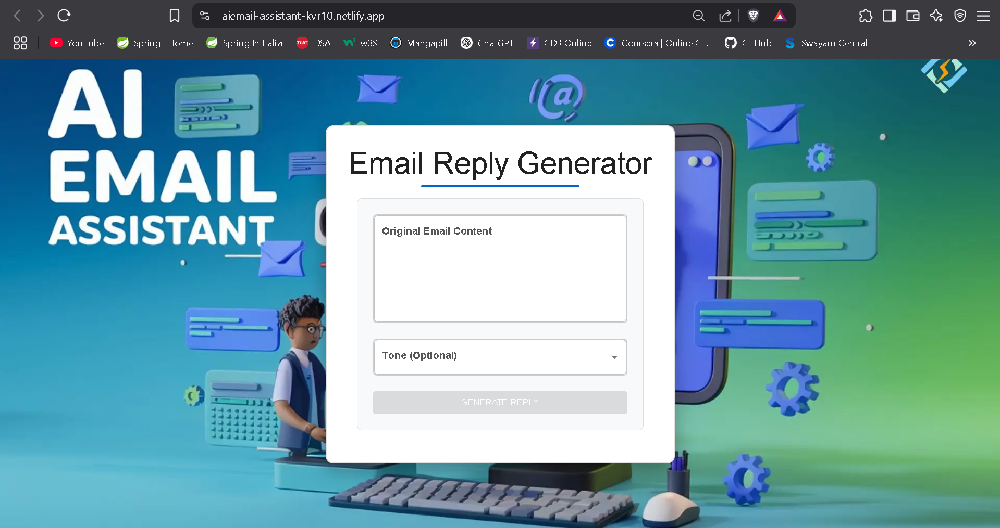
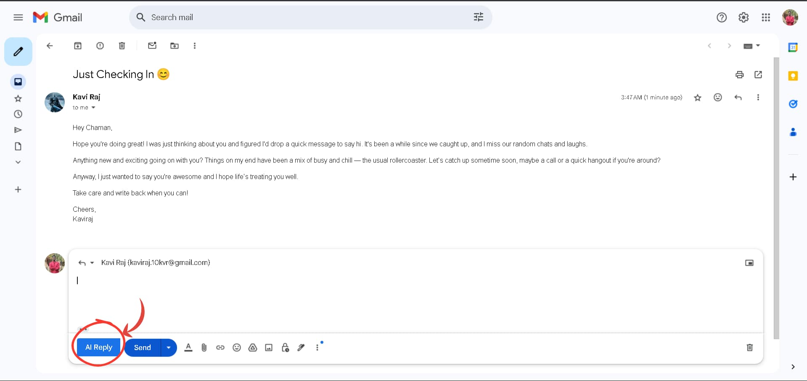

# AI Email Assistant

A full-stack **AI-powered email reply generator** with **Google Mail extension** integration, built with a **Spring Boot** backend and **React + Vite** frontend.

---

## 🚀 Demo

> **🎥 Click to watch the demo:**  
<p align="center">
  <a href="https://www.youtube.com/watch?v=GhceCjThWqo" target="_blank">
    
  </a>
</p>

---

## ✨ Features

- 🤖 **AI Email Generation**: Generate context-aware email replies using AI  
- 🎭 **Tone Customization**: Select from *professional*, *casual*, or *friendly* tones  
- 📧 **Google Mail Integration**: Browser extension adds an **"AI Reply"** button directly in Gmail  
- 🖥️ **Responsive Web Interface**: Clean, modern UI built with **Material-UI**  
- 📋 **Clipboard Integration**: One-click copy of generated replies  

---

## 🛠️ Technologies Used

### Backend

- **Spring Boot (Java)**
- **REST API**
- **Render** (Hosting)

### Frontend

- **React (Vite)**
- **Material-UI (MUI)**
- **Axios**
- **Netlify** (Hosting)

### Extension

- **Chrome Extension API**
- **Google Mail API** integration

### DevOps & Deployment

- **CI/CD**: GitHub Actions  
- **Containerization**: Docker  
- **Hosting**:
  - Backend: [Render](https://render.com)  
  - Frontend: [Netlify](https://www.netlify.com)  

---

## 🌐 Live Demo

- 🔗 **[Web Application](https://aiemail-assistant-kvr10.netlify.app/)**
- 🔗 **[Backend URL](https://aiemail-backend.onrender.com)**
- 📦 **Extension Download**: [**Get it on Firefox Add-ons**](https://addons.mozilla.org/en-US/firefox/addon/email-writer-assitant/)

## 🧪 How to Run the Extension Locally in Chrome or Brave

1. Download or clone the repository:
   ```bash
   git clone https://github.com/Kvr-10/AiEmail-Assistant/AiEmail-writer-ext
   ```
2. Open Chrome or Brave, then type `chrome://extensions/` in the address bar and press Enter.

3. Enable Developer mode using the toggle in the top-right corner.

4. Click “Load unpacked”.
   
5. Select the `AiEmail-writer-ext` folder (which contains `manifest.json`).
   
✅ Your extension should now be loaded and active on Gmail.

> **Note**: The backend service on Render may take ~50 seconds to respond on first request due to cold start.

---

## 📸 Screenshots

<p align="center">
  <br>
  <strong>🌐 Web Interface</strong>
</p>

<p align="center">
  <br>
  <strong>💬 Sample Reply Example</strong>
</p>

<p align="center">
  <br>
  <br>
  <strong>📬 Gmail Extension</strong>
</p>


---

## ⚙️ Installation

### Prerequisites

- Java JDK 17+  
- Node.js 16+  
- Maven  
- npm  

---

## 🔧 Backend Setup

```bash
git clone https://github.com/Kvr-10/AiEmail-Assistant
cd AIEmail-Assistant/backend
```

---

## 🔐 Configure environment variables:
```bash
# Create application.properties file
echo "OPENAI_API_KEY=your-api-key" >> src/main/resources/application.properties
```

---

## 🛠️ Build and run 
```bash
mvn clean install
mvn spring-boot:run
```

---

## 🌐 Frontend Setup
```bash
cd ../frontend
npm install
npm run dev
```

---

## 🧩 Extension Setup
```bash
cd ../extension
npm install
npm run build
```
Then load the unpacked extension in Chrome via chrome://extensions.

---

## 📡 API Endpoints
| Method | Endpoint               | Description             |
|--------|------------------------|-------------------------|
|GET	   | /	                    | Health check            | 
|POST	   | /api/email/generate    | Generate AI email reply |

---

## 📥 Request Body:
```json
{
  "emailContent": "original email text",
  "tone": "professional/casual/friendly"
}
```

---

## 🚀 Deployment

| Component | Service             |
|-----------|---------------------|
| Frontend  | [Netlify](https://www.netlify.com)         |
| Backend   | [Render](https://render.com)               |
| Extension | Chrome Web Store    *(coming soon!)*       |

---

## 📬 Contact

- 📧 **Email**: [chamansinha9480@gmail.com](mailto:chamansinha9480@gmail.com)
- 🌐 **Portfolio**: [Chaman Sinha](https://kvr-10.github.io/) 
- 🐙 **GitHub**: [@Kvr-10](https://github.com/Kvr-10)

                                    

